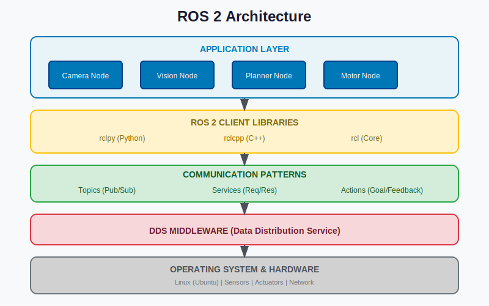

# Introduction to ROS 2

## Learning Objectives

By the end of this lesson, you will be able to:

- **Explain** what ROS 2 is and why it's called a "robot operating system"
- **Describe** the key differences between ROS 1 and ROS 2
- **Identify** the four core communication patterns: nodes, topics, services, and actions
- **Install** ROS 2 Humble on Ubuntu 22.04
- **Run** the classic talker/listener demo and observe ROS 2 in action

## Introduction

Welcome to your first hands-on experience with ROS 2! In this lesson, we'll explore why ROS 2 is considered the "nervous system" of modern robots, install it on your system, and run your first ROS 2 application.

ROS 2 (Robot Operating System 2) might sound like an operating system, but it's actually something more interesting: a **middleware framework** that helps different parts of a robot communicate with each other. Just like your nervous system connects your senses to your brain and muscles, ROS 2 connects sensors, processors, and actuators.

By the end of this lesson, you'll have ROS 2 running on your computer and understand the fundamental building blocks that make robot software work.

---

## What is ROS 2?

### Theory

ROS 2 is not actually an operating system—it runs *on top of* operating systems like Linux, Windows, or macOS. Instead, ROS 2 is a collection of:

- **Libraries** for common robotics tasks
- **Tools** for debugging, visualization, and testing
- **Conventions** that help developers work together
- **Communication infrastructure** that connects software components

Think of ROS 2 as the "plumbing" that connects all the pieces of robot software together.

### The Nervous System Metaphor

Consider how your body works:

| Human Body | Robot with ROS 2 |
|------------|------------------|
| Eyes, ears, skin (sensors) | Cameras, LIDAR, IMU |
| Nerves (signal carriers) | Topics, services, actions |
| Brain (processing) | Compute nodes |
| Muscles (actuators) | Motors, grippers |
| Nervous system (coordination) | ROS 2 middleware |

Your nervous system doesn't care whether a signal comes from your finger or your eye—it just routes information where it needs to go. Similarly, ROS 2 doesn't care whether data comes from a camera or a force sensor—it provides a uniform way to send and receive information.

### Why "ROS 2" (Not ROS 1)?

ROS 1 was created in 2007 and served the robotics community well, but it had limitations:

| Limitation | ROS 1 | ROS 2 |
|------------|-------|-------|
| Real-time support | Not built-in | Native support |
| Security | No authentication | DDS security |
| Multi-robot | Complex workarounds | Native support |
| Embedded systems | Limited | Full support |
| Windows/macOS | Experimental | Production-ready |

ROS 2 was built from scratch with these improvements in mind. For new projects in 2025 and beyond, **ROS 2 is the standard**.

---

## Core Concepts

### Theory

ROS 2 has four fundamental communication patterns. Understanding these is essential before writing any code.

### 1. Nodes

A **node** is a single-purpose process that performs one task. Robots typically have many nodes running simultaneously:

```
┌─────────────┐  ┌─────────────┐  ┌─────────────┐  ┌─────────────┐
│ Camera Node │  │ Vision Node │  │ Planner Node│  │ Motor Node  │
│ (capture)   │  │ (process)   │  │ (decide)    │  │ (move)      │
└─────────────┘  └─────────────┘  └─────────────┘  └─────────────┘
```

**Why separate nodes?** Modularity! If your vision code crashes, it doesn't take down your motor control. Nodes can be developed, tested, and deployed independently.

### 2. Topics

A **topic** is a named channel for one-way, streaming communication. Nodes *publish* messages to topics, and other nodes *subscribe* to receive them.

```
Camera Node ──publish──▶ /camera/image ──subscribe──▶ Vision Node
                                        ──subscribe──▶ Logger Node
```

Topics are perfect for continuous data streams like sensor readings. Multiple subscribers can receive the same data.

### 3. Services

A **service** provides request-response communication. A client sends a request, waits for the server to process it, and receives a response.

```
Planner ──request──▶ /calculate_path ──response──▶ Path returned
        (start, goal)                              (waypoints)
```

Services are ideal for one-time operations where you need a result before continuing.

### 4. Actions

An **action** is like a service for long-running tasks. Actions provide:
- **Goal**: What you want to accomplish
- **Feedback**: Progress updates during execution
- **Result**: Final outcome when complete
- **Cancellation**: Ability to stop mid-execution

```
"Walk to kitchen" ──goal──▶ Navigation Action Server
                   ◀──feedback── "50% complete, 3m remaining"
                   ◀──feedback── "90% complete, 0.5m remaining"
                   ◀──result── "Arrived at kitchen"
```

Actions are perfect for tasks like navigation, manipulation, or any operation that takes time.

---

## Installation on Ubuntu 22.04

### Theory

We'll install ROS 2 Humble Hawksbill, the Long-Term Support (LTS) release supported until 2027. We'll use the recommended binary installation method.

### Code Example: Setting Up ROS 2 Repository

First, ensure your system is up to date and add the ROS 2 repository:

```bash
# Update system packages
sudo apt update && sudo apt upgrade -y

# Install required tools
sudo apt install -y software-properties-common curl gnupg lsb-release

# Add the ROS 2 GPG key
sudo curl -sSL https://raw.githubusercontent.com/ros/rosdistro/master/ros.key -o /usr/share/keyrings/ros-archive-keyring.gpg

# Add the ROS 2 repository
echo "deb [arch=$(dpkg --print-architecture) signed-by=/usr/share/keyrings/ros-archive-keyring.gpg] http://packages.ros.org/ros2/ubuntu $(. /etc/os-release && echo $UBUNTU_CODENAME) main" | sudo tee /etc/apt/sources.list.d/ros2.list > /dev/null

# Update package index
sudo apt update
```

### Code Example: Installing ROS 2 Desktop

Now install the full ROS 2 desktop package:

```bash
# Install ROS 2 Humble Desktop (full installation)
sudo apt install -y ros-humble-desktop

# Install development tools
sudo apt install -y python3-colcon-common-extensions python3-rosdep

# Initialize rosdep (first time only)
sudo rosdep init
rosdep update
```

### Code Example: Sourcing the Environment

ROS 2 needs to be "sourced" before use. Add this to your `.bashrc` for automatic sourcing:

```bash
# Add ROS 2 to your shell
echo "source /opt/ros/humble/setup.bash" >> ~/.bashrc

# Apply changes to current terminal
source ~/.bashrc
```

### Code Example: Verify Installation

Confirm ROS 2 is installed correctly:

```bash
# Check ROS 2 version
ros2 --version
```

**Expected Output**:
```
ros2 0.9.0
```

```bash
# Check available commands
ros2 --help
```

**Expected Output**:
```
usage: ros2 [-h] Call `ros2 <command> -h` for more detailed usage. ...

ros2 is an extensible command-line tool for ROS 2.

optional arguments:
  -h, --help            show this help message and exit

Commands:
  action     Various action related sub-commands
  bag        Various rosbag related sub-commands
  ...
```

---

## Alternative Setup: WSL2 and Docker

### For Windows Users (WSL2)

If you're on Windows, use Windows Subsystem for Linux 2 (WSL2):

```bash
# In PowerShell (as Administrator)
wsl --install -d Ubuntu-22.04

# After reboot, open Ubuntu from Start menu
# Then follow the Ubuntu installation steps above
```

**Tips for WSL2**:
- Install an X server (like VcXsrv) for GUI applications
- Add `export DISPLAY=:0` to your `.bashrc`
- Use Windows Terminal for better experience

### For macOS Users (Docker)

macOS doesn't support ROS 2 natively. Use Docker:

```bash
# Pull the official ROS 2 Humble image
docker pull ros:humble

# Run an interactive container
docker run -it --rm \
  --name ros2_humble \
  -e DISPLAY=host.docker.internal:0 \
  ros:humble \
  bash

# Inside the container, source ROS 2
source /opt/ros/humble/setup.bash
```

**Tips for Docker**:
- Use Docker volumes to persist your workspace
- Install XQuartz for GUI support
- Consider using VS Code with Remote Containers extension

---

## First Demo: Talker/Listener

### Theory

The talker/listener demo is the "Hello World" of ROS 2. It demonstrates:
- Two nodes running simultaneously
- Topic-based communication
- Message passing in real-time

### Code Example: Running the Demo

Open two terminal windows (both must have ROS 2 sourced).

**Terminal 1 - Start the Talker**:
```bash
# Run the talker node (C++ version)
ros2 run demo_nodes_cpp talker
```

**Expected Output**:
```
[INFO] [1234567890.123456789] [talker]: Publishing: 'Hello World: 0'
[INFO] [1234567890.223456789] [talker]: Publishing: 'Hello World: 1'
[INFO] [1234567890.323456789] [talker]: Publishing: 'Hello World: 2'
...
```

**Terminal 2 - Start the Listener**:
```bash
# Run the listener node (C++ version)
ros2 run demo_nodes_cpp listener
```

**Expected Output**:
```
[INFO] [1234567890.123456789] [listener]: I heard: [Hello World: 0]
[INFO] [1234567890.223456789] [listener]: I heard: [Hello World: 1]
[INFO] [1234567890.323456789] [listener]: I heard: [Hello World: 2]
...
```

**Congratulations!** You just witnessed ROS 2 communication in action!

### Code Example: Exploring with ROS 2 CLI

While the demo is running, open a third terminal to explore:

```bash
# List all running nodes
ros2 node list
```

**Expected Output**:
```
/listener
/talker
```

```bash
# List all active topics
ros2 topic list
```

**Expected Output**:
```
/chatter
/parameter_events
/rosout
```

```bash
# See what's being published on /chatter
ros2 topic echo /chatter
```

**Expected Output**:
```
data: Hello World: 42
---
data: Hello World: 43
---
```

```bash
# Get information about the topic
ros2 topic info /chatter
```

**Expected Output**:
```
Type: std_msgs/msg/String
Publisher count: 1
Subscription count: 1
```

---

## Diagrams


*Figure 1: ROS 2 Architecture - Nodes communicate through topics, services, and actions via the DDS middleware layer.*


*Figure 2: ROS 2 Communication Patterns - Topics for streaming, Services for request-response, Actions for long tasks.*

---

## Hardware Notes

> **Simulation vs. Real Hardware**
>
> Everything in this lesson runs on your computer without any robot hardware. The talker/listener demo represents what happens in a real robot:
>
> - **Talker** → Could be a sensor publishing data
> - **Listener** → Could be a processor receiving and acting on that data
>
> When you move to real robots:
> - Ensure network connectivity between all devices
> - Consider latency and real-time requirements
> - Use appropriate QoS settings for your network conditions

---

## Summary

In this lesson, you learned:

- ✅ **ROS 2 is middleware**, not an operating system—it connects robot software components
- ✅ **Four communication patterns**: Nodes, Topics, Services, and Actions
- ✅ **ROS 2 improves on ROS 1** with real-time support, security, and multi-platform compatibility
- ✅ **Installation** via apt packages on Ubuntu 22.04 (or WSL2/Docker)
- ✅ **The talker/listener demo** shows basic topic communication

---

## AI-Assisted Learning

<details>
<summary>Ask the AI Assistant</summary>

### Conceptual Questions
- "What is the difference between a topic and a service in ROS 2? When should I use each?"
- "Why is ROS 2 called a 'robot operating system' if it's not really an OS?"

### Debugging Help
- "I ran `ros2 run demo_nodes_cpp talker` but got 'package not found'. How do I fix this?"
- "My listener node isn't receiving messages from the talker. What could be wrong?"

### Extension Ideas
- "How would I modify the talker to publish custom messages instead of strings?"
- "Can I run ROS 2 nodes on different computers? How would I set that up?"

</details>

---

## Exercises

### Exercise 1: Explore ROS 2 Commands (Easy)

**Description**: Use the ROS 2 CLI to explore the system while the talker/listener demo is running.

**Tasks**:
1. List all nodes using `ros2 node list`
2. Get information about the talker node using `ros2 node info /talker`
3. Find what topics the listener subscribes to

**Acceptance Criteria**: You can explain what the `/chatter` topic is used for and identify the message type.

### Exercise 2: Change the Message Rate (Medium)

**Description**: The talker publishes at 1 Hz by default. Discover how to change this.

**Tasks**:
1. Stop the running talker
2. Use `ros2 run demo_nodes_cpp talker --ros-args -p frequency:=5.0` to publish at 5 Hz
3. Observe the faster message rate

**Acceptance Criteria**: Messages appear 5 times per second instead of once per second.

---

## Troubleshooting

### Common Issues

**Problem**: `ros2: command not found`
**Solution**: Source ROS 2 environment:
```bash
source /opt/ros/humble/setup.bash
```

**Problem**: `Package 'demo_nodes_cpp' not found`
**Solution**: Install the full desktop package:
```bash
sudo apt install ros-humble-desktop
```

**Problem**: `Unable to communicate with master`
**Solution**: Unlike ROS 1, ROS 2 doesn't use a master. If you see this error, you may be accidentally using ROS 1 commands.

---

## Navigation

| Previous | Up | Next |
|----------|-----|------|
| [Chapter Introduction](../introduction.md) | [Chapter 1 Home](../README.md) | [B2: Basic Sensors Overview](./02-sensors-overview.md) |

---

## Next Steps

Continue to [B2: Basic Sensors Overview](./02-sensors-overview.md) to learn about the sensors that give robots their senses.
