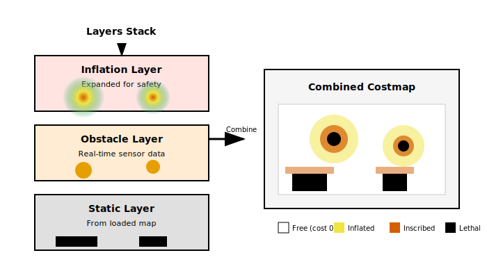

# A1: Costmap Configuration

**Customizing Navigation Cost Maps for Your Robot**

---

## Learning Objectives

By the end of this lesson, you will be able to:
- Explain the purpose and structure of Nav2 costmaps
- Configure global and local costmaps
- Add and tune costmap layers (static, obstacle, inflation)
- Customize costmap behavior for specific environments

---

## Prerequisites

- Completed Intermediate tier (I1-I4)
- Nav2 running with basic configuration
- Understanding of occupancy grids

---

## Theory: What are Costmaps?

### Purpose

**Costmaps** provide a 2D representation of where the robot can safely travel. They assign a **cost** to each cell:

| Cost Value | Meaning | Robot Behavior |
|------------|---------|----------------|
| 0 | Free space | Safe to traverse |
| 1-252 | Increasing danger | Prefer lower-cost paths |
| 253 | Inscribed cost | Robot might collide |
| 254 | Lethal cost | Definite collision |
| 255 | Unknown | Unexplored area |

### Costmap Types

| Type | Purpose | Update Rate |
|------|---------|-------------|
| **Global Costmap** | Planning long paths | Slow (~1Hz) |
| **Local Costmap** | Obstacle avoidance | Fast (~5-10Hz) |



*Alt-text: Diagram showing costmap layer composition. At the bottom, the Static Layer (from loaded map). Above it, the Obstacle Layer (from real-time sensors). At the top, the Inflation Layer (expanded obstacles for safety). All layers combine into the final costmap.*

---

## Costmap Layers

### Static Layer

**Source**: The loaded map file (PGM/YAML from SLAM)

**Purpose**: Provides known obstacles that don't change

```yaml
static_layer:
  plugin: "nav2_costmap_2d::StaticLayer"
  map_subscribe_transient_local: True
```

### Obstacle Layer

**Source**: Real-time sensor data (LIDAR, depth camera)

**Purpose**: Detects dynamic obstacles not in the static map

```yaml
obstacle_layer:
  plugin: "nav2_costmap_2d::ObstacleLayer"
  enabled: True
  observation_sources: scan
  scan:
    topic: /scan
    max_obstacle_height: 2.0
    clearing: True
    marking: True
    data_type: "LaserScan"
    raytrace_max_range: 3.0
    raytrace_min_range: 0.0
    obstacle_max_range: 2.5
    obstacle_min_range: 0.0
```

### Inflation Layer

**Purpose**: Expands obstacles to account for robot size

```yaml
inflation_layer:
  plugin: "nav2_costmap_2d::InflationLayer"
  cost_scaling_factor: 3.0
  inflation_radius: 0.55
```

**Key Parameters**:
- `inflation_radius`: How far to expand obstacles (robot radius + safety margin)
- `cost_scaling_factor`: How quickly cost decays from obstacles

---

## Code Example: Complete Costmap Configuration

```yaml
# costmap_config.yaml
# Complete Nav2 costmap configuration for a TurtleBot3

global_costmap:
  global_costmap:
    ros__parameters:
      update_frequency: 1.0
      publish_frequency: 1.0
      global_frame: map
      robot_base_frame: base_link
      use_sim_time: True
      robot_radius: 0.22  # TurtleBot3 radius
      resolution: 0.05    # 5cm per cell
      track_unknown_space: true
      plugins: ["static_layer", "obstacle_layer", "inflation_layer"]

      static_layer:
        plugin: "nav2_costmap_2d::StaticLayer"
        map_subscribe_transient_local: True

      obstacle_layer:
        plugin: "nav2_costmap_2d::ObstacleLayer"
        enabled: True
        observation_sources: scan
        scan:
          topic: /scan
          max_obstacle_height: 2.0
          clearing: True
          marking: True
          data_type: "LaserScan"
          raytrace_max_range: 3.0
          obstacle_max_range: 2.5

      inflation_layer:
        plugin: "nav2_costmap_2d::InflationLayer"
        cost_scaling_factor: 3.0
        inflation_radius: 0.55

local_costmap:
  local_costmap:
    ros__parameters:
      update_frequency: 5.0
      publish_frequency: 2.0
      global_frame: odom
      robot_base_frame: base_link
      use_sim_time: True
      rolling_window: true
      width: 3             # 3m x 3m window
      height: 3
      resolution: 0.05
      robot_radius: 0.22
      plugins: ["voxel_layer", "inflation_layer"]

      voxel_layer:
        plugin: "nav2_costmap_2d::VoxelLayer"
        enabled: True
        publish_voxel_map: True
        origin_z: 0.0
        z_resolution: 0.05
        z_voxels: 16
        max_obstacle_height: 2.0
        mark_threshold: 0
        observation_sources: scan
        scan:
          topic: /scan
          max_obstacle_height: 2.0
          clearing: True
          marking: True
          data_type: "LaserScan"
          raytrace_max_range: 3.0
          obstacle_max_range: 2.5

      inflation_layer:
        plugin: "nav2_costmap_2d::InflationLayer"
        cost_scaling_factor: 3.0
        inflation_radius: 0.55
```

---

## Tuning Guidelines

### For Tight Spaces

```yaml
# Smaller robot footprint, less inflation
robot_radius: 0.18
inflation_layer:
  inflation_radius: 0.35
  cost_scaling_factor: 5.0  # Steeper falloff
```

### For Open Environments

```yaml
# Larger safety margin, gentler falloff
robot_radius: 0.22
inflation_layer:
  inflation_radius: 0.75
  cost_scaling_factor: 2.0  # Gentler falloff
```

### For Dynamic Environments

```yaml
# Faster updates, shorter memory
local_costmap:
  update_frequency: 10.0
obstacle_layer:
  observation_persistence: 0.0  # No memory
  raytrace_max_range: 5.0
```

---

## Visualization in RViz2

### View Costmaps

1. Add **Map** display for `/global_costmap/costmap`
2. Add **Map** display for `/local_costmap/costmap`
3. Set different color schemes to distinguish them

### View Inflation

The inflation layer shows cost gradient:
- **Red**: Lethal (definite collision)
- **Yellow/Orange**: Inscribed (possible collision)
- **Blue/Cyan**: Preferred path area

---

## Key Concepts Summary

| Concept | Description |
|---------|-------------|
| **Costmap** | 2D grid of traversal costs |
| **Static Layer** | Loaded from map file |
| **Obstacle Layer** | Real-time sensor detections |
| **Inflation Layer** | Expands obstacles for safety |
| **Rolling Window** | Local costmap that follows robot |

---

## Hands-On Exercise

### Exercise A1.1: Tune for Your Robot

1. Measure your robot's actual radius
2. Add a 10cm safety margin
3. Configure `inflation_radius` = radius + margin
4. Test navigation through a narrow doorway

### Exercise A1.2: Add Depth Camera Layer

Add a depth camera to the obstacle layer:

```yaml
observation_sources: scan depth
depth:
  topic: /depth_camera/points
  data_type: "PointCloud2"
  max_obstacle_height: 1.5
  min_obstacle_height: 0.1
```

---

## AI Agent Assisted Prompts

### Prompt 1: Costmap Debugging
```
My robot's costmap shows obstacles where there are none. The "phantom obstacles"
appear and disappear randomly. What could cause this and how do I debug it?
```

### Prompt 2: Multi-Floor Navigation
```
My robot operates on multiple floors. How should I configure costmaps for
elevator transitions? What about stairwells that should be blocked?
```

### Prompt 3: Social Navigation
```
I want my robot to maintain distance from people (not just avoid collision).
How can I add a "social layer" to the costmap that treats detected humans
differently from static obstacles?
```

---

## Summary

In this lesson, you learned:

1. **Costmaps** represent traversal costs for navigation
2. **Layers** (static, obstacle, inflation) combine to form costmaps
3. **Global vs Local** costmaps serve different purposes
4. **Inflation** expands obstacles for robot safety
5. How to **tune parameters** for different scenarios

---

## Next Steps

- **Next Lesson**: [A2: Planners and Behavior Trees](A2-planners-behavior-trees.md) - Customizing path planning
- **Exercises**: Try tuning costmaps for different scenarios
