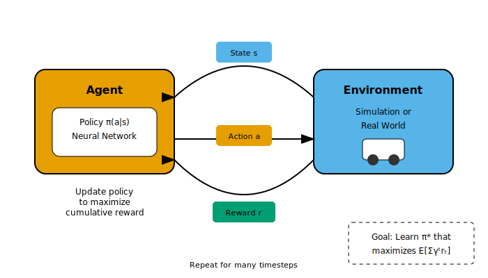

# A3: Reinforcement Learning Fundamentals

**Teaching Robots to Learn from Experience**

---

## Learning Objectives

By the end of this lesson, you will be able to:
- Explain the reinforcement learning framework (agent, environment, reward)
- Describe Markov Decision Processes (MDPs)
- Understand policy and value functions
- Compare popular RL algorithms (PPO, SAC)
- Describe NVIDIA Isaac Gym for robot learning

---

## Prerequisites

- Completed Advanced Navigation tier (A1-A2)
- Basic understanding of neural networks
- Python programming experience

---

## Theory: What is Reinforcement Learning?

### The RL Framework

**Reinforcement Learning (RL)** teaches an agent to make decisions by interacting with an environment and receiving rewards.



*Alt-text: Diagram showing the reinforcement learning loop. The Agent observes State from the Environment, takes an Action based on its Policy, receives a Reward signal, and transitions to a new State. This cycle repeats, with the agent learning to maximize cumulative reward over time.*

### Key Components

| Component | Definition | Robot Example |
|-----------|------------|---------------|
| **Agent** | The learner/decision-maker | Robot controller |
| **Environment** | The world the agent acts in | Simulation or real world |
| **State (s)** | Current observation | Joint positions, camera image |
| **Action (a)** | What the agent can do | Motor commands |
| **Reward (r)** | Feedback signal | +1 for reaching goal, -1 for collision |
| **Policy (π)** | Strategy: state → action | Neural network |

### The Goal

Find a **policy** that maximizes **cumulative reward** over time:

```
Maximize: E[R] = E[r₀ + γr₁ + γ²r₂ + γ³r₃ + ...]
```

Where γ (gamma) is the **discount factor** (0.99 typical), making future rewards less valuable.

---

## Theory: Markov Decision Processes

### MDP Definition

An **MDP** formalizes the RL problem:

- **S**: Set of states
- **A**: Set of actions
- **P(s'|s,a)**: Transition probability (physics)
- **R(s,a,s')**: Reward function
- **γ**: Discount factor

### Markov Property

The future only depends on the **current state**, not the history:

```
P(s_{t+1} | s_t, a_t) = P(s_{t+1} | s_0, a_0, s_1, a_1, ..., s_t, a_t)
```

This simplification makes RL tractable.

---

## Theory: Policies and Value Functions

### Policy (π)

A policy maps states to actions:

- **Deterministic**: π(s) = a
- **Stochastic**: π(a|s) = P(action a | state s)

Neural network policies output action probabilities or continuous values.

### Value Functions

**State Value V(s)**: Expected return starting from state s

```
V^π(s) = E[R | s, π]
```

**Action Value Q(s,a)**: Expected return from state s, taking action a

```
Q^π(s,a) = E[R | s, a, π]
```

### Policy vs Value-Based Methods

| Approach | Learns | Algorithms |
|----------|--------|------------|
| **Policy-based** | Policy directly | REINFORCE, PPO |
| **Value-based** | Value function → derive policy | DQN, DDQN |
| **Actor-Critic** | Both | A3C, SAC, PPO |

---

## Popular RL Algorithms

### PPO (Proximal Policy Optimization)

**Key Features**:
- Stable training with clipped objectives
- Good sample efficiency
- Easy to tune
- Most popular for robotics

```python
# PPO objective (simplified)
ratio = π_new(a|s) / π_old(a|s)
clipped_ratio = clip(ratio, 1-ε, 1+ε)
loss = -min(ratio * A, clipped_ratio * A)
```

### SAC (Soft Actor-Critic)

**Key Features**:
- Maximum entropy framework
- Excellent exploration
- Works well for continuous control
- Better sample efficiency than PPO

### When to Use Which

| Scenario | Recommended |
|----------|-------------|
| General robotics, locomotion | PPO |
| Complex manipulation | SAC |
| Discrete actions | DQN/PPO |
| Need exploration | SAC |
| Production deployment | PPO |

---

## NVIDIA Isaac Gym Overview

### What is Isaac Gym?

**Isaac Gym** is NVIDIA's GPU-accelerated physics simulator for RL:

- **Thousands of parallel environments** on one GPU
- **End-to-end GPU training** (no CPU bottleneck)
- **Built-in RL algorithms** (PPO, SAC)
- **Robotics assets** (hands, quadrupeds, humanoids)

### Training Pipeline

```
Isaac Gym Simulation (GPU)
    ↓
Observations (GPU tensors)
    ↓
Neural Network Policy (GPU)
    ↓
Actions (GPU tensors)
    ↓
Environment Step (GPU physics)
    ↓
Rewards (GPU tensors)
```

### Example: Training a Walking Robot

```python
# Conceptual Isaac Gym training loop
from isaacgym import gymapi, gymtorch

# Create thousands of parallel environments
env_cfg = {"num_envs": 4096, "robot": "anymal"}
env = AnymalEnv(env_cfg)

# Training loop
for epoch in range(1000):
    # Collect experience (all envs in parallel)
    obs = env.get_observations()
    actions = policy(obs)
    env.step(actions)
    rewards = env.get_rewards()

    # Update policy (on GPU)
    policy.update(obs, actions, rewards)
```

---

## Reward Design for Robotics

### Reward Engineering

Designing good rewards is crucial and challenging:

| Goal | Reward Component |
|------|-----------------|
| Move forward | +v_x (forward velocity) |
| Stay upright | +cos(pitch) * cos(roll) |
| Energy efficiency | -|τ|² (torque penalty) |
| Smooth motion | -|a_t - a_{t-1}|² |
| Reach target | +1 if ||pos - goal|| &lt; 0.1 |

### Common Pitfalls

- **Sparse rewards**: Robot never gets signal
- **Reward hacking**: Robot finds loopholes
- **Conflicting rewards**: Opposing objectives

### Best Practices

1. Start with dense rewards (frequent feedback)
2. Use curriculum learning (easy → hard)
3. Add termination conditions (fall = reset)
4. Normalize rewards to similar scales

---

## Key Concepts Summary

| Concept | Definition |
|---------|------------|
| **RL** | Learning from rewards through trial and error |
| **MDP** | Mathematical framework for sequential decisions |
| **Policy (π)** | Mapping from states to actions |
| **Value (V, Q)** | Expected future reward |
| **PPO** | Stable policy gradient algorithm |
| **SAC** | Maximum entropy actor-critic |
| **Isaac Gym** | GPU-accelerated RL simulator |

---

## Hands-On Exercise

### Exercise A3.1: Reward Function Design

Design a reward function for a robot arm reaching task:

**Goal**: Move end-effector to target position

Consider:
1. Distance to target
2. Velocity at target (should be slow)
3. Joint limits (don't overextend)
4. Energy efficiency

Write the reward function as pseudocode.

<details>
<summary>Click for suggested answer</summary>

```python
def compute_reward(state, target):
    # Distance to target (negative, closer is better)
    dist = np.linalg.norm(state.ee_pos - target)
    reward_distance = -dist

    # Velocity penalty at target (slow approach)
    reward_velocity = -0.1 * np.linalg.norm(state.ee_vel)

    # Joint limit penalty
    reward_joints = -0.01 * sum(
        max(0, j - j_max) + max(0, j_min - j)
        for j, j_min, j_max in zip(state.joints, joint_mins, joint_maxs)
    )

    # Energy penalty
    reward_energy = -0.001 * np.sum(state.torques ** 2)

    # Success bonus
    reward_success = 10.0 if dist &lt; 0.05 else 0.0

    return reward_distance + reward_velocity + reward_joints + reward_energy + reward_success
```

</details>

### Exercise A3.2: Algorithm Comparison

Compare PPO and SAC for these scenarios:

| Scenario | Better Algorithm | Why? |
|----------|-----------------|------|
| Quadruped walking | ? | ? |
| Dexterous manipulation | ? | ? |
| Navigation in maze | ? | ? |

---

## AI Agent Assisted Prompts

### Prompt 1: Reward Shaping
```
My robot arm RL policy keeps getting stuck at local optima - it moves
toward the target but stops before reaching it. The reward is simply
-distance_to_target. What reward shaping techniques can help?
```

### Prompt 2: Training Stability
```
My PPO training is very unstable - the reward oscillates and sometimes
collapses. What hyperparameters should I tune first? What clipping
values and learning rates are typical for robotics?
```

### Prompt 3: Sim-to-Real Gap
```
My policy works perfectly in Isaac Gym but fails on the real robot.
What are the main causes of sim-to-real gap? What techniques can
help transfer policies successfully?
```

---

## Summary

In this lesson, you learned:

1. **RL framework**: Agent learns from rewards
2. **MDPs** formalize sequential decision problems
3. **Policies** map states to actions
4. **PPO and SAC** are popular algorithms for robotics
5. **Isaac Gym** enables fast parallel training
6. **Reward design** is crucial and challenging

---

## Next Steps

- **Next Lesson**: [A4: Sim-to-Real Transfer](A4-sim-to-real.md) - Deploying learned policies on real robots
- **Exercises**: Design rewards for different robot tasks
