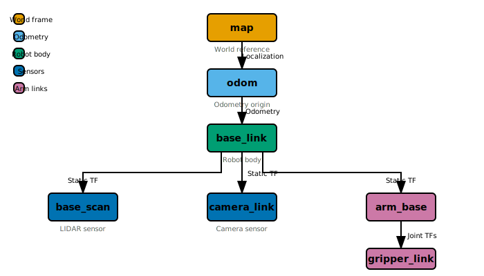

# I2: TF2 Coordinate Frames

**Managing Coordinate Transforms for Multi-Sensor Robots**

---

## Learning Objectives

By the end of this lesson, you will be able to:
- Explain the purpose of TF2 and coordinate frames
- Visualize the TF tree for a robot
- Create a static transform broadcaster
- Look up transforms between frames programmatically

---

## Prerequisites

- Completed [I1: Camera and Depth Data Processing](I1-camera-depth-processing.md)
- Understanding of coordinate systems (x, y, z, roll, pitch, yaw)
- ROS 2 tf2 packages installed

---

## Chapter 1 Refresher: URDF and Frames

> **Quick Review**: A robot's **URDF** (Unified Robot Description Format) defines links and joints.
> Each link has a **coordinate frame**. TF2 tracks the relationships between all frames.
>
> Common frames:
> - `base_link` - Robot body center
> - `base_footprint` - Ground projection of base_link
> - `odom` - Odometry origin (drifts over time)
> - `map` - Fixed world frame
>
> See [ROS 2 Refresher](../beginner/refresher-ros2.md) for more details.

---

## Theory: Why Coordinate Frames Matter

### The Multi-Sensor Problem

Consider a robot with:
- A camera on its head
- A LIDAR on its base
- A gripper on its arm

Each sensor reports data in its **own coordinate frame**:
- Camera: "Object at pixel (320, 240)"
- LIDAR: "Obstacle at (1.5m, 0.3m) relative to sensor"
- Gripper: "Contact at (0.1m, 0, 0) from gripper tip"

**Problem**: How do you combine this data to answer "Where is the object in the world?"

### TF2: The Transform Library

**TF2** (Transform Framework 2) solves this by:
1. Maintaining a **tree of transforms** between all frames
2. Allowing **lookups** between any two frames
3. Handling **time** (transforms can change over time)



*Alt-text: TF tree diagram showing frame hierarchy. At top, 'map' frame connects to 'odom' frame (localization transform). 'odom' connects to 'base_link' (odometry). 'base_link' branches to 'base_scan' (LIDAR), 'camera_link' (camera), and 'arm_base' (robot arm). 'arm_base' connects through joints to 'gripper_link'.*

### Transform Representation

A transform from frame A to frame B includes:
- **Translation**: (x, y, z) offset in meters
- **Rotation**: Quaternion (x, y, z, w) or Euler angles

```python
# geometry_msgs/msg/TransformStamped
header:
  stamp: builtin_interfaces/Time
  frame_id: "parent_frame"  # e.g., "base_link"
child_frame_id: "child_frame"  # e.g., "camera_link"
transform:
  translation:
    x: 0.1  # 10cm forward
    y: 0.0
    z: 0.3  # 30cm up
  rotation:
    x: 0.0
    y: 0.0
    z: 0.0
    w: 1.0  # No rotation (identity quaternion)
```

---

## Types of Transforms

### Static Transforms

**Definition**: Transforms that never change (fixed mounting positions).

**Examples**:
- Camera mounted 30cm above base_link
- LIDAR mounted at center of robot base
- Sensor calibration offsets

**How to publish**:
```bash
# Command line
ros2 run tf2_ros static_transform_publisher \
    0.1 0 0.3 0 0 0 base_link camera_link
```

### Dynamic Transforms

**Definition**: Transforms that change over time.

**Examples**:
- Robot arm joint positions
- `odom` → `base_link` (changes as robot moves)
- `map` → `odom` (localization corrections)

**How to publish**: Use a `TransformBroadcaster` in code.

---

## Code Example: TF2 Broadcaster

This node publishes a static transform for a camera:

```python
#!/usr/bin/env python3
"""
tf2_broadcaster.py

Broadcasts static and dynamic transforms for robot sensors.
Demonstrates TF2 transform publishing.

ROS 2 TF:
  Published: /tf (for dynamic) or /tf_static (for static)

Dependencies: rclpy, geometry_msgs, tf2_ros

Usage:
  ros2 run <package_name> tf2_broadcaster
"""

import rclpy
from rclpy.node import Node
from geometry_msgs.msg import TransformStamped
from tf2_ros import StaticTransformBroadcaster, TransformBroadcaster
import math


class TF2Broadcaster(Node):
    """ROS 2 node that broadcasts coordinate frame transforms."""

    def __init__(self):
        super().__init__('tf2_broadcaster')

        # Static transform broadcaster (for fixed sensor mounts)
        self.static_broadcaster = StaticTransformBroadcaster(self)

        # Dynamic transform broadcaster (for moving parts)
        self.dynamic_broadcaster = TransformBroadcaster(self)

        # Publish static transforms once
        self.publish_static_transforms()

        # Timer for dynamic transforms (e.g., rotating sensor)
        self.timer = self.create_timer(0.1, self.publish_dynamic_transforms)
        self.angle = 0.0

        self.get_logger().info('TF2 broadcaster started')

    def publish_static_transforms(self):
        """Publish static transforms for fixed sensor mounts."""

        # Camera mount: 10cm forward, 30cm up from base_link
        camera_tf = TransformStamped()
        camera_tf.header.stamp = self.get_clock().now().to_msg()
        camera_tf.header.frame_id = 'base_link'
        camera_tf.child_frame_id = 'camera_link'

        # Translation (meters)
        camera_tf.transform.translation.x = 0.1
        camera_tf.transform.translation.y = 0.0
        camera_tf.transform.translation.z = 0.3

        # Rotation (quaternion - no rotation)
        camera_tf.transform.rotation.x = 0.0
        camera_tf.transform.rotation.y = 0.0
        camera_tf.transform.rotation.z = 0.0
        camera_tf.transform.rotation.w = 1.0

        # LIDAR mount: centered, 15cm up
        lidar_tf = TransformStamped()
        lidar_tf.header.stamp = self.get_clock().now().to_msg()
        lidar_tf.header.frame_id = 'base_link'
        lidar_tf.child_frame_id = 'base_scan'

        lidar_tf.transform.translation.x = 0.0
        lidar_tf.transform.translation.y = 0.0
        lidar_tf.transform.translation.z = 0.15

        lidar_tf.transform.rotation.x = 0.0
        lidar_tf.transform.rotation.y = 0.0
        lidar_tf.transform.rotation.z = 0.0
        lidar_tf.transform.rotation.w = 1.0

        # Publish both static transforms
        self.static_broadcaster.sendTransform([camera_tf, lidar_tf])
        self.get_logger().info('Published static transforms for camera_link and base_scan')

    def publish_dynamic_transforms(self):
        """Publish dynamic transforms for moving parts."""

        # Example: A rotating sensor platform
        sensor_tf = TransformStamped()
        sensor_tf.header.stamp = self.get_clock().now().to_msg()
        sensor_tf.header.frame_id = 'base_link'
        sensor_tf.child_frame_id = 'rotating_sensor'

        # Position: 20cm forward
        sensor_tf.transform.translation.x = 0.2
        sensor_tf.transform.translation.y = 0.0
        sensor_tf.transform.translation.z = 0.1

        # Rotation: slowly rotating around Z axis
        self.angle += 0.05  # radians per update
        if self.angle > 2 * math.pi:
            self.angle -= 2 * math.pi

        # Convert yaw angle to quaternion
        sensor_tf.transform.rotation.x = 0.0
        sensor_tf.transform.rotation.y = 0.0
        sensor_tf.transform.rotation.z = math.sin(self.angle / 2)
        sensor_tf.transform.rotation.w = math.cos(self.angle / 2)

        self.dynamic_broadcaster.sendTransform(sensor_tf)


def main(args=None):
    rclpy.init(args=args)
    node = TF2Broadcaster()

    try:
        rclpy.spin(node)
    except KeyboardInterrupt:
        pass
    finally:
        node.destroy_node()
        rclpy.shutdown()


if __name__ == '__main__':
    main()
```

---

## Demonstration: Visualizing TF

### Step 1: Launch Simulation

```bash
# Terminal 1: Launch robot
export TURTLEBOT3_MODEL=waffle
ros2 launch turtlebot3_gazebo turtlebot3_world.launch.py
```

### Step 2: View TF Tree

```bash
# Terminal 2: Generate TF tree PDF
ros2 run tf2_tools view_frames

# Open the generated PDF
evince frames.pdf  # or use your PDF viewer
```

### Step 3: Echo Specific Transform

```bash
# Get transform between two frames
ros2 run tf2_ros tf2_echo base_link camera_link
```

### Step 4: Visualize in RViz2

```bash
# Terminal 3: Launch RViz2
rviz2
```

In RViz2:
1. Set **Fixed Frame** to `odom`
2. Click **Add** → **TF**
3. Expand **TF** display to see all frames
4. Enable **Show Names** and **Show Axes**

---

## Looking Up Transforms in Code

To use transforms in your perception code:

```python
import rclpy
from rclpy.node import Node
from tf2_ros import Buffer, TransformListener
from geometry_msgs.msg import PointStamped


class TransformLookup(Node):
    def __init__(self):
        super().__init__('transform_lookup')

        # TF2 buffer and listener
        self.tf_buffer = Buffer()
        self.tf_listener = TransformListener(self.tf_buffer, self)

    def transform_point(self, point_in_camera):
        """Transform a point from camera frame to base_link frame."""
        try:
            # Look up the transform
            transform = self.tf_buffer.lookup_transform(
                'base_link',      # Target frame
                'camera_link',    # Source frame
                rclpy.time.Time() # Latest available
            )

            # Apply transform to point
            # (In practice, use tf2_geometry_msgs for this)
            self.get_logger().info(f'Transform: {transform}')

        except Exception as e:
            self.get_logger().warn(f'Transform lookup failed: {e}')
```

---

## Key Concepts Summary

| Concept | Description |
|---------|-------------|
| **TF2** | Transform library for tracking frame relationships |
| **Frame** | A coordinate system attached to a link |
| **Static Transform** | Fixed relationship (sensor mounts) |
| **Dynamic Transform** | Changing relationship (joints, odometry) |
| **TF Tree** | Hierarchy of all frame relationships |

---

## Hands-On Exercise

### Exercise I2.1: Add a New Sensor Frame

Modify `tf2_broadcaster.py` to add an IMU sensor mounted:
- 5cm behind base_link center (negative X)
- 10cm above base_link (positive Z)
- Rotated 180° around Z (facing backward)

### Exercise I2.2: Transform Point Between Frames

Write a node that:
1. Subscribes to a PointStamped message in `camera_link` frame
2. Transforms it to `base_link` frame
3. Publishes the transformed point

Hint: Use `tf2_geometry_msgs` for the do_transform_point function.

---

## AI Agent Assisted Prompts

### Prompt 1: Multi-Sensor Calibration
```
I have a camera and LIDAR on my robot. The LIDAR detects an object, and I want
to find where that object appears in the camera image. What TF lookups do I
need? How do I project a 3D LIDAR point onto the 2D camera image plane?
```

### Prompt 2: TF Debugging
```
My robot's TF tree shows a disconnect - base_link doesn't connect to odom.
What could cause this? How do I debug TF issues in ROS 2?
```

### Prompt 3: Time Synchronization
```
My camera and LIDAR have different timestamps. When I look up transforms,
sometimes I get "extrapolation into the future" errors. What's happening
and how do I fix it?
```

---

## Summary

In this lesson, you learned:

1. **TF2** manages coordinate frame relationships
2. The **TF tree** shows the hierarchy of all frames
3. **Static transforms** are for fixed mounts, **dynamic** for moving parts
4. You can **look up transforms** between any two connected frames
5. **RViz2** visualizes the TF tree with axes and names

---

## Next Steps

- **Next Lesson**: [I3: SLAM Toolbox Configuration](I3-slam-toolbox.md) - Building maps with SLAM
- **Exercises**: Complete the exercises above before continuing
