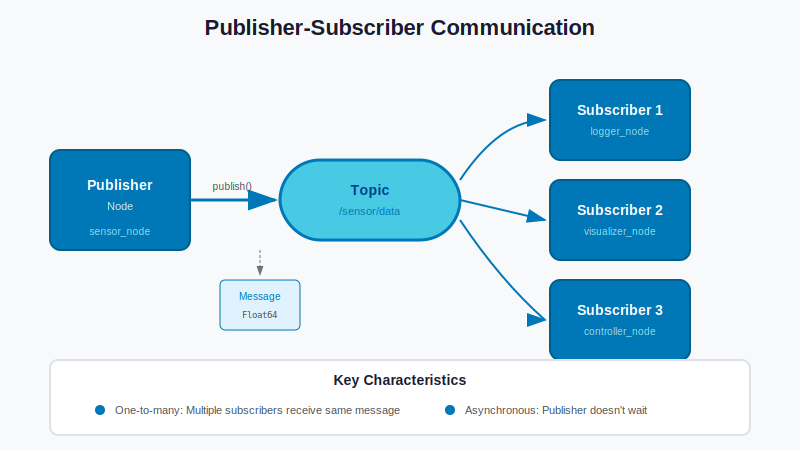

# Nodes, Topics, Services, and Actions

## Learning Objectives

By the end of this lesson, you will be able to:

- **Create** ROS 2 Python nodes using rclpy
- **Implement** publishers and subscribers for topic-based communication
- **Build** service servers and clients for request-response patterns
- **Understand** action concepts for long-running tasks with feedback
- **Apply** Quality of Service (QoS) settings for reliable communication

## Introduction

In the Beginner tier, you learned what nodes, topics, services, and actions are conceptually. Now it's time to build them yourself.

This lesson takes you from observer to creator. You'll write Python code that creates ROS 2 nodes, publishes sensor data, subscribes to commands, and implements services. By the end, you'll have working code that you can adapt for your own robot projects.

We'll use `rclpy`, the official Python client library for ROS 2, which provides a clean, Pythonic interface to all ROS 2 functionality.

---

## Creating Python Nodes with rclpy

### Theory

A **node** is the fundamental unit of computation in ROS 2. Each node should do one thing well—this is the Unix philosophy applied to robotics.

The `rclpy` library provides everything you need to create nodes in Python:

```
┌─────────────────────────────────────────────────────────────┐
│                     rclpy Node Structure                     │
├─────────────────────────────────────────────────────────────┤
│                                                              │
│   import rclpy                                               │
│   from rclpy.node import Node                                │
│                                                              │
│   class MyNode(Node):                                        │
│       def __init__(self):                                    │
│           super().__init__('my_node_name')                   │
│           # Create publishers, subscribers, timers, etc.     │
│                                                              │
│   def main():                                                │
│       rclpy.init()                                           │
│       node = MyNode()                                        │
│       rclpy.spin(node)        # Process callbacks            │
│       node.destroy_node()                                    │
│       rclpy.shutdown()                                       │
│                                                              │
└─────────────────────────────────────────────────────────────┘
```

**Key concepts:**
- `rclpy.init()`: Initialize the ROS 2 Python client library
- `Node`: Base class for all ROS 2 nodes
- `rclpy.spin()`: Keep the node running and process callbacks
- `rclpy.shutdown()`: Clean up resources

### Code Example: Minimal Node

```python
#!/usr/bin/env python3
"""Minimal ROS 2 node that logs a message."""

import rclpy
from rclpy.node import Node


class MinimalNode(Node):
    """A minimal ROS 2 node that logs periodically."""

    def __init__(self):
        # Initialize the node with a name
        super().__init__('minimal_node')

        # Log that we've started
        self.get_logger().info('Minimal node has started!')

        # Create a timer that fires every second
        self.timer = self.create_timer(1.0, self.timer_callback)
        self.counter = 0

    def timer_callback(self):
        """Called every time the timer fires."""
        self.counter += 1
        self.get_logger().info(f'Timer fired: count = {self.counter}')


def main(args=None):
    # Initialize rclpy
    rclpy.init(args=args)

    # Create and spin the node
    node = MinimalNode()

    try:
        rclpy.spin(node)
    except KeyboardInterrupt:
        pass
    finally:
        node.destroy_node()
        rclpy.shutdown()


if __name__ == '__main__':
    main()
```

---

## Publishers and Subscribers

### Theory

**Topics** enable one-way, streaming communication between nodes:

- **Publisher**: Sends messages to a topic
- **Subscriber**: Receives messages from a topic
- **Decoupled**: Publishers don't know who subscribes; subscribers don't know who publishes

This decoupling is powerful—you can add or remove nodes without changing existing code.

```
┌──────────────┐                          ┌──────────────┐
│   Publisher  │                          │  Subscriber  │
│    Node      │                          │    Node      │
├──────────────┤      ┌──────────┐        ├──────────────┤
│              │      │          │        │              │
│  publish() ──┼─────▶│  /topic  │───────▶│ callback()   │
│              │      │          │        │              │
└──────────────┘      └──────────┘        └──────────────┘
                     Message Queue
```

### Code Example: Minimal Publisher

```python
#!/usr/bin/env python3
"""ROS 2 publisher that sends String messages."""

import rclpy
from rclpy.node import Node
from std_msgs.msg import String


class MinimalPublisher(Node):
    """Publishes String messages to /chatter topic."""

    def __init__(self):
        super().__init__('minimal_publisher')

        # Create publisher: message type, topic name, queue size
        self.publisher = self.create_publisher(String, 'chatter', 10)

        # Create timer to publish periodically
        timer_period = 0.5  # seconds (2 Hz)
        self.timer = self.create_timer(timer_period, self.timer_callback)
        self.count = 0

        self.get_logger().info('Publisher node started')

    def timer_callback(self):
        """Publish a message every timer tick."""
        msg = String()
        msg.data = f'Hello, ROS 2! Count: {self.count}'

        self.publisher.publish(msg)
        self.get_logger().info(f'Publishing: "{msg.data}"')

        self.count += 1


def main(args=None):
    rclpy.init(args=args)
    node = MinimalPublisher()

    try:
        rclpy.spin(node)
    except KeyboardInterrupt:
        pass
    finally:
        node.destroy_node()
        rclpy.shutdown()


if __name__ == '__main__':
    main()
```

### Code Example: Minimal Subscriber

```python
#!/usr/bin/env python3
"""ROS 2 subscriber that receives String messages."""

import rclpy
from rclpy.node import Node
from std_msgs.msg import String


class MinimalSubscriber(Node):
    """Subscribes to String messages from /chatter topic."""

    def __init__(self):
        super().__init__('minimal_subscriber')

        # Create subscription: message type, topic name, callback, queue size
        self.subscription = self.create_subscription(
            String,
            'chatter',
            self.listener_callback,
            10
        )

        self.get_logger().info('Subscriber node started, listening on /chatter')

    def listener_callback(self, msg: String):
        """Called whenever a message is received."""
        self.get_logger().info(f'Received: "{msg.data}"')


def main(args=None):
    rclpy.init(args=args)
    node = MinimalSubscriber()

    try:
        rclpy.spin(node)
    except KeyboardInterrupt:
        pass
    finally:
        node.destroy_node()
        rclpy.shutdown()


if __name__ == '__main__':
    main()
```

### Hands-on Exercise: Run Publisher and Subscriber

1. Save the publisher code as `minimal_publisher.py`
2. Save the subscriber code as `minimal_subscriber.py`
3. Make them executable: `chmod +x *.py`
4. In Terminal 1: `python3 minimal_publisher.py`
5. In Terminal 2: `python3 minimal_subscriber.py`
6. In Terminal 3: Explore with `ros2 topic list` and `ros2 topic echo /chatter`

---

## Topic QoS Basics

### Theory

**Quality of Service (QoS)** settings control how messages are delivered. QoS is critical for real robots where network reliability varies.

| QoS Profile | Reliability | Durability | Use Case |
|-------------|-------------|------------|----------|
| Default | Reliable | Volatile | Most topics |
| Sensor Data | Best Effort | Volatile | High-frequency sensors |
| Services | Reliable | Volatile | Request/response |
| Parameters | Reliable | Transient Local | Configuration |

**Key QoS policies:**

- **Reliability**: `RELIABLE` (guaranteed delivery) vs `BEST_EFFORT` (may drop)
- **Durability**: `VOLATILE` (no history) vs `TRANSIENT_LOCAL` (keep for late joiners)
- **History**: `KEEP_LAST(n)` vs `KEEP_ALL`
- **Depth**: Queue size for KEEP_LAST

### Code Example: Custom QoS

```python
from rclpy.qos import QoSProfile, ReliabilityPolicy, DurabilityPolicy

# Create a custom QoS profile for sensor data
sensor_qos = QoSProfile(
    reliability=ReliabilityPolicy.BEST_EFFORT,
    durability=DurabilityPolicy.VOLATILE,
    depth=10
)

# Use it when creating publisher/subscriber
self.publisher = self.create_publisher(
    Image,
    '/camera/image_raw',
    sensor_qos
)
```

**When to use BEST_EFFORT:**
- High-frequency sensor data (IMU at 100+ Hz)
- Camera images (dropping a frame is OK)
- When latency matters more than completeness

**When to use RELIABLE:**
- Commands that must arrive (motor commands)
- State changes (robot mode transitions)
- Low-frequency but critical data

---

## Services: Request-Response Pattern

### Theory

**Services** provide synchronous request-response communication:

1. Client sends a **request**
2. Server processes the request
3. Server returns a **response**
4. Client receives the response

Unlike topics, services are bidirectional and blocking (the client waits for a response).

```
┌──────────────┐         Request          ┌──────────────┐
│    Client    │ ────────────────────────▶│    Server    │
│              │                          │              │
│              │◀──────────────────────── │              │
└──────────────┘         Response         └──────────────┘
```

### Code Example: Simple Service Server

```python
#!/usr/bin/env python3
"""ROS 2 service server that adds two integers."""

import rclpy
from rclpy.node import Node
from example_interfaces.srv import AddTwoInts


class AddTwoIntsServer(Node):
    """Service server that adds two integers."""

    def __init__(self):
        super().__init__('add_two_ints_server')

        # Create service: service type, service name, callback
        self.srv = self.create_service(
            AddTwoInts,
            'add_two_ints',
            self.add_callback
        )

        self.get_logger().info('Service server ready: /add_two_ints')

    def add_callback(self, request, response):
        """Handle incoming service requests."""
        response.sum = request.a + request.b
        self.get_logger().info(
            f'Request: {request.a} + {request.b} = {response.sum}'
        )
        return response


def main(args=None):
    rclpy.init(args=args)
    node = AddTwoIntsServer()

    try:
        rclpy.spin(node)
    except KeyboardInterrupt:
        pass
    finally:
        node.destroy_node()
        rclpy.shutdown()


if __name__ == '__main__':
    main()
```

### Code Example: Simple Service Client

```python
#!/usr/bin/env python3
"""ROS 2 service client that calls add_two_ints."""

import rclpy
from rclpy.node import Node
from example_interfaces.srv import AddTwoInts


class AddTwoIntsClient(Node):
    """Service client that adds two integers."""

    def __init__(self):
        super().__init__('add_two_ints_client')

        # Create client for the service
        self.client = self.create_client(AddTwoInts, 'add_two_ints')

        # Wait for service to be available
        while not self.client.wait_for_service(timeout_sec=1.0):
            self.get_logger().info('Waiting for service...')

        self.get_logger().info('Service available!')

    def send_request(self, a: int, b: int):
        """Send a request and wait for response."""
        request = AddTwoInts.Request()
        request.a = a
        request.b = b

        # Call service asynchronously
        future = self.client.call_async(request)

        # Wait for result
        rclpy.spin_until_future_complete(self, future)

        return future.result()


def main(args=None):
    rclpy.init(args=args)
    client = AddTwoIntsClient()

    # Send request
    response = client.send_request(3, 5)
    client.get_logger().info(f'Result: 3 + 5 = {response.sum}')

    client.destroy_node()
    rclpy.shutdown()


if __name__ == '__main__':
    main()
```

### Hands-on Exercise: Test the Service

1. In Terminal 1: Run the service server
2. In Terminal 2: Use CLI to call the service:
   ```bash
   ros2 service call /add_two_ints example_interfaces/srv/AddTwoInts "{a: 10, b: 20}"
   ```
3. Run the client code to see programmatic service calls

---

## Actions: Long-Running Tasks with Feedback

### Theory

**Actions** are for tasks that:
- Take a long time to complete
- Need to provide progress feedback
- Should be cancellable

Actions combine three communication patterns:
1. **Goal**: Client sends what it wants (like a service request)
2. **Feedback**: Server sends progress updates (like topic messages)
3. **Result**: Server sends final outcome (like a service response)

```
┌──────────────┐                          ┌──────────────┐
│    Action    │         Goal             │    Action    │
│    Client    │ ────────────────────────▶│    Server    │
│              │                          │              │
│              │◀──────────────────────── │              │
│              │     Feedback (stream)    │              │
│              │                          │              │
│              │◀──────────────────────── │              │
└──────────────┘         Result           └──────────────┘
```

**Humanoid robot examples:**
- "Walk to the kitchen" → Feedback: "50% complete, 3m remaining"
- "Pick up the cup" → Feedback: "Approaching... Grasping... Lifting..."
- "Navigate to charging station" → Can be cancelled if user calls robot

### Code Example: Action Concepts

```python
# Action definition (in .action file):
# ---
# Goal: What we want to achieve
# int32 target_position
# ---
# Result: Final outcome
# bool success
# int32 final_position
# ---
# Feedback: Progress updates
# int32 current_position
# float32 percent_complete
```

Actions are more complex to implement than topics or services. The full implementation is covered in the Advanced tier. For now, understand the pattern:

```python
# Conceptual action client usage (simplified)
goal = MoveToPosition.Goal()
goal.target_position = 100

# Send goal and get feedback
future = action_client.send_goal_async(goal, feedback_callback=on_feedback)

def on_feedback(feedback_msg):
    print(f"Progress: {feedback_msg.feedback.percent_complete}%")
```

---

## Diagrams


*Figure 1: Topic-based communication showing one publisher sending messages to multiple subscribers through a named topic.*


*Figure 2: Service communication showing synchronous request-response between client and server.*


*Figure 3: Action communication showing goal submission, streaming feedback, and final result.*

---

## Hardware Notes

> **Simulation vs. Real Hardware**
>
> The code in this lesson runs without any robot hardware. When deploying to real robots:
>
> | Consideration | Development | Production |
> |---------------|-------------|------------|
> | QoS Settings | Default/Reliable | Match sensor characteristics |
> | Error Handling | Basic try/except | Robust recovery logic |
> | Timing | Python timers | Consider real-time constraints |
> | Network | Localhost | Configure DDS for multi-machine |
>
> **Tips for real deployment:**
> - Test with simulated sensor noise before real hardware
> - Use `ros2 topic hz` to verify actual publish rates
> - Monitor CPU usage—Python nodes can be CPU-intensive
> - Consider C++ for performance-critical nodes

---

## Summary

In this lesson, you learned:

- ✅ **Nodes** are created by subclassing `rclpy.node.Node`
- ✅ **Publishers** send messages to topics using `create_publisher()`
- ✅ **Subscribers** receive messages using `create_subscription()`
- ✅ **QoS settings** control reliability, durability, and history
- ✅ **Services** provide synchronous request-response communication
- ✅ **Actions** handle long-running tasks with feedback and cancellation

---

## AI-Assisted Learning

<details>
<summary>Ask the AI Assistant</summary>

### Conceptual Questions
- "What's the difference between spinning a node and just calling callbacks manually?"
- "When should I use a service instead of publishing a request on a topic and subscribing to a response topic?"

### Debugging Help
- "My subscriber callback never gets called even though the publisher is running. What should I check?"
- "I get 'service not available' even though the server is running. How do I debug this?"

### Extension Ideas
- "How would I create a node that both publishes and subscribes to different topics?"
- "Can I have multiple callbacks running at the same time? How do executors work?"

</details>

---

## Exercises

### Exercise 1: Sensor Publisher (Easy)

**Description**: Modify the minimal publisher to publish sensor-like data.

**Tasks**:
1. Change the message type from `String` to `Float64`
2. Publish simulated temperature readings (random values between 20.0 and 30.0)
3. Use topic name `/sensor/temperature`

**Acceptance Criteria**:
- [ ] Node publishes Float64 messages
- [ ] Values are in the 20-30 range
- [ ] `ros2 topic echo /sensor/temperature` shows the values

### Exercise 2: Message Counter (Medium)

**Description**: Create a subscriber that counts messages and reports statistics.

**Tasks**:
1. Subscribe to the `/chatter` topic
2. Count total messages received
3. Every 10 messages, log: count, first message, last message
4. Calculate and log messages per second

**Acceptance Criteria**:
- [ ] Accurately counts messages
- [ ] Calculates correct message rate
- [ ] Handles the publisher stopping and restarting

### Exercise 3: Calculation Service (Medium)

**Description**: Create a service that performs basic math operations.

**Tasks**:
1. Define what operations to support (add, subtract, multiply, divide)
2. Handle division by zero gracefully
3. Create both server and client

**Acceptance Criteria**:
- [ ] All four operations work correctly
- [ ] Division by zero returns an error (not crash)
- [ ] Can be called from CLI and from client code

---

## Navigation

| Previous | Up | Next |
|----------|-----|------|
| [B2: Basic Sensors Overview](../beginner/02-sensors-overview.md) | [Chapter 1 Home](../README.md) | [I2: Python ROS Bridge (rclpy)](./02-python-ros-bridge.md) |

---

## Next Steps

Continue to [I2: Python ROS Bridge (rclpy)](./02-python-ros-bridge.md) to learn about node lifecycle, parameters, launch files, and executors.
