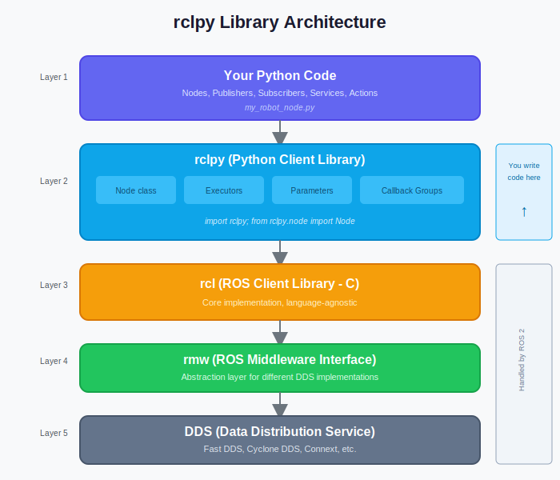

# Python ROS Bridge (rclpy)

## Learning Objectives

By the end of this lesson, you will be able to:

- **Navigate** the rclpy library structure and key classes
- **Manage** node lifecycle states for robust robot applications
- **Declare** and use parameters for configurable nodes
- **Create** launch files to orchestrate multiple nodes
- **Choose** appropriate executors and callback groups for your application

## Introduction

In the previous lesson, you created basic nodes with publishers, subscribers, and services. Now we'll go deeper into `rclpy`—the Python client library that makes all of this possible.

Understanding rclpy's architecture helps you write more robust, configurable, and efficient robot software. You'll learn how nodes manage their lifecycle, how to make nodes configurable without code changes, and how to launch complex multi-node systems.

---

## rclpy Library Overview

### Theory

`rclpy` (ROS Client Library for Python) is the official Python API for ROS 2. It provides:

```
┌─────────────────────────────────────────────────────────────┐
│                      rclpy Architecture                      │
├─────────────────────────────────────────────────────────────┤
│                                                              │
│   ┌─────────────────────────────────────────────────────┐   │
│   │                  Your Python Code                    │   │
│   │     (Nodes, Publishers, Subscribers, Services)       │   │
│   └─────────────────────────────────────────────────────┘   │
│                            │                                 │
│                            ▼                                 │
│   ┌─────────────────────────────────────────────────────┐   │
│   │                     rclpy                            │   │
│   │  • Node class       • Executors                      │   │
│   │  • Publishers       • Callback groups               │   │
│   │  • Subscribers      • Parameters                     │   │
│   │  • Services/Actions • Timers                         │   │
│   └─────────────────────────────────────────────────────┘   │
│                            │                                 │
│                            ▼                                 │
│   ┌─────────────────────────────────────────────────────┐   │
│   │                    rcl (C Library)                   │   │
│   └─────────────────────────────────────────────────────┘   │
│                            │                                 │
│                            ▼                                 │
│   ┌─────────────────────────────────────────────────────┐   │
│   │               rmw (ROS Middleware)                   │   │
│   └─────────────────────────────────────────────────────┘   │
│                            │                                 │
│                            ▼                                 │
│   ┌─────────────────────────────────────────────────────┐   │
│   │              DDS (Data Distribution Service)         │   │
│   └─────────────────────────────────────────────────────┘   │
│                                                              │
└─────────────────────────────────────────────────────────────┘
```

**Key rclpy modules:**

| Module | Purpose |
|--------|---------|
| `rclpy` | Top-level functions (init, shutdown, spin) |
| `rclpy.node` | Node base class |
| `rclpy.qos` | Quality of Service profiles |
| `rclpy.parameter` | Parameter handling |
| `rclpy.executors` | Callback execution strategies |
| `rclpy.callback_groups` | Callback threading control |

### Code Example: Exploring rclpy

```python
import rclpy
from rclpy.node import Node

# Check rclpy version info
print(f"rclpy distribution: {rclpy.get_rmw_implementation_identifier()}")

# Common Node methods you'll use:
class ExampleNode(Node):
    def __init__(self):
        super().__init__('example_node')

        # Logging at different levels
        self.get_logger().debug('Debug message')
        self.get_logger().info('Info message')
        self.get_logger().warn('Warning message')
        self.get_logger().error('Error message')

        # Get node information
        print(f"Node name: {self.get_name()}")
        print(f"Namespace: {self.get_namespace()}")
        print(f"Fully qualified name: {self.get_fully_qualified_name()}")

        # Get the clock
        now = self.get_clock().now()
        print(f"Current time: {now.nanoseconds} ns")
```

---

## Node Lifecycle

### Theory

ROS 2 supports **managed nodes** with a defined lifecycle. This is crucial for:
- Safe startup and shutdown sequences
- Coordinating multiple nodes
- Error recovery

**Lifecycle states:**

```
                    ┌─────────────┐
                    │ Unconfigured │
                    └──────┬──────┘
                           │ configure()
                           ▼
                    ┌─────────────┐
                    │  Inactive   │
                    └──────┬──────┘
                           │ activate()
                           ▼
                    ┌─────────────┐
         cleanup() │   Active    │ deactivate()
              ┌────┤             ├────┐
              │    └─────────────┘    │
              │                       │
              ▼                       ▼
       ┌─────────────┐         ┌─────────────┐
       │ Unconfigured │         │  Inactive   │
       └─────────────┘         └─────────────┘
```

**When to use lifecycle nodes:**
- Hardware drivers (configure sensors before activating)
- Safety-critical systems (controlled startup/shutdown)
- Complex robot systems requiring coordination

### Code Example: Simple Lifecycle-Aware Node

```python
#!/usr/bin/env python3
"""Lifecycle-aware node pattern."""

import rclpy
from rclpy.node import Node


class LifecycleAwareNode(Node):
    """
    A node that demonstrates lifecycle-aware patterns.

    For full lifecycle node support, use rclpy.lifecycle.LifecycleNode.
    This example shows the pattern without the full lifecycle API.
    """

    def __init__(self):
        super().__init__('lifecycle_aware_node')
        self.is_configured = False
        self.is_active = False

        self.get_logger().info('Node created (unconfigured)')

    def configure(self) -> bool:
        """Configure the node - initialize resources."""
        self.get_logger().info('Configuring...')

        try:
            # Initialize hardware, load parameters, etc.
            self.declare_parameter('robot_name', 'default_robot')
            self.robot_name = self.get_parameter('robot_name').value

            self.is_configured = True
            self.get_logger().info(f'Configured for robot: {self.robot_name}')
            return True

        except Exception as e:
            self.get_logger().error(f'Configuration failed: {e}')
            return False

    def activate(self) -> bool:
        """Activate the node - start processing."""
        if not self.is_configured:
            self.get_logger().error('Cannot activate: not configured')
            return False

        self.get_logger().info('Activating...')

        # Create publishers, subscribers, timers
        self.timer = self.create_timer(1.0, self.timer_callback)

        self.is_active = True
        self.get_logger().info('Active and running')
        return True

    def deactivate(self):
        """Deactivate the node - stop processing."""
        self.get_logger().info('Deactivating...')

        if hasattr(self, 'timer'):
            self.destroy_timer(self.timer)

        self.is_active = False
        self.get_logger().info('Deactivated')

    def cleanup(self):
        """Cleanup resources."""
        self.get_logger().info('Cleaning up...')
        self.is_configured = False

    def timer_callback(self):
        """Called when timer fires (only when active)."""
        if self.is_active:
            self.get_logger().info(f'{self.robot_name}: heartbeat')


def main():
    rclpy.init()
    node = LifecycleAwareNode()

    # Simulate lifecycle transitions
    if node.configure():
        if node.activate():
            try:
                rclpy.spin(node)
            except KeyboardInterrupt:
                pass
            finally:
                node.deactivate()
                node.cleanup()

    node.destroy_node()
    rclpy.shutdown()


if __name__ == '__main__':
    main()
```

---

## Parameters: Declaration and Usage

### Theory

**Parameters** make nodes configurable without changing code. They're key-value pairs that can be:
- Set at launch time
- Changed at runtime
- Saved to and loaded from files

**Parameter types:**
- `bool`, `int`, `double`, `string`
- Arrays of the above types
- Byte arrays

### Code Example: Parameter-Driven Node

```python
#!/usr/bin/env python3
"""Node with runtime-configurable parameters."""

import rclpy
from rclpy.node import Node
from rcl_interfaces.msg import ParameterDescriptor, SetParametersResult


class ConfigurableNode(Node):
    """A node with configurable parameters."""

    def __init__(self):
        super().__init__('configurable_node')

        # Declare parameters with descriptions
        self.declare_parameter(
            'update_rate',
            10.0,
            ParameterDescriptor(description='Publishing rate in Hz')
        )

        self.declare_parameter(
            'robot_name',
            'humanoid_01',
            ParameterDescriptor(description='Name of the robot')
        )

        self.declare_parameter(
            'enabled',
            True,
            ParameterDescriptor(description='Enable/disable processing')
        )

        # Get initial parameter values
        self.update_rate = self.get_parameter('update_rate').value
        self.robot_name = self.get_parameter('robot_name').value
        self.enabled = self.get_parameter('enabled').value

        # Register callback for parameter changes
        self.add_on_set_parameters_callback(self.parameter_callback)

        # Create timer based on update_rate
        self.timer = self.create_timer(1.0 / self.update_rate, self.timer_callback)

        self.get_logger().info(
            f'Started: robot={self.robot_name}, rate={self.update_rate}Hz'
        )

    def parameter_callback(self, params) -> SetParametersResult:
        """Called when parameters are changed."""
        for param in params:
            self.get_logger().info(
                f'Parameter changed: {param.name} = {param.value}'
            )

            if param.name == 'update_rate':
                if param.value <= 0:
                    return SetParametersResult(
                        successful=False,
                        reason='update_rate must be positive'
                    )
                self.update_rate = param.value
                # Recreate timer with new rate
                self.destroy_timer(self.timer)
                self.timer = self.create_timer(
                    1.0 / self.update_rate,
                    self.timer_callback
                )

            elif param.name == 'robot_name':
                self.robot_name = param.value

            elif param.name == 'enabled':
                self.enabled = param.value

        return SetParametersResult(successful=True)

    def timer_callback(self):
        """Timer callback respects enabled parameter."""
        if self.enabled:
            self.get_logger().info(f'{self.robot_name}: tick at {self.update_rate}Hz')


def main():
    rclpy.init()
    node = ConfigurableNode()

    try:
        rclpy.spin(node)
    except KeyboardInterrupt:
        pass
    finally:
        node.destroy_node()
        rclpy.shutdown()


if __name__ == '__main__':
    main()
```

### Hands-on Exercise: Parameter Manipulation

Run the configurable node and try these commands:

```bash
# List all parameters
ros2 param list /configurable_node

# Get a parameter value
ros2 param get /configurable_node update_rate

# Set a parameter at runtime
ros2 param set /configurable_node update_rate 2.0
ros2 param set /configurable_node enabled false

# Dump parameters to file
ros2 param dump /configurable_node > my_params.yaml

# Load parameters from file (at launch)
ros2 run my_package my_node --ros-args --params-file my_params.yaml
```

---

## Launch Files: Multi-Node Orchestration

### Theory

**Launch files** start and configure multiple nodes at once. In ROS 2, launch files are Python scripts, giving you full programming power.

**Launch file capabilities:**
- Start multiple nodes
- Set parameters
- Remap topics
- Set environment variables
- Include other launch files
- Conditional logic

### Code Example: Launch File

```python
#!/usr/bin/env python3
"""
Launch file for talker/listener demo with parameters.

Usage:
    ros2 launch my_package talker_listener_launch.py
    ros2 launch my_package talker_listener_launch.py rate:=5.0
"""

from launch import LaunchDescription
from launch.actions import DeclareLaunchArgument
from launch.substitutions import LaunchConfiguration
from launch_ros.actions import Node


def generate_launch_description():
    """Generate the launch description."""

    # Declare launch arguments (can be overridden from command line)
    rate_arg = DeclareLaunchArgument(
        'rate',
        default_value='2.0',
        description='Publishing rate in Hz'
    )

    prefix_arg = DeclareLaunchArgument(
        'prefix',
        default_value='robot1',
        description='Prefix for node names and topics'
    )

    # Create talker node
    talker_node = Node(
        package='demo_nodes_cpp',
        executable='talker',
        name='talker',
        namespace=LaunchConfiguration('prefix'),
        parameters=[{
            'frequency': LaunchConfiguration('rate')
        }],
        remappings=[
            ('chatter', 'messages')  # Remap /chatter to /messages
        ],
        output='screen'
    )

    # Create listener node
    listener_node = Node(
        package='demo_nodes_cpp',
        executable='listener',
        name='listener',
        namespace=LaunchConfiguration('prefix'),
        remappings=[
            ('chatter', 'messages')
        ],
        output='screen'
    )

    return LaunchDescription([
        rate_arg,
        prefix_arg,
        talker_node,
        listener_node
    ])
```

### Launch File Features

```python
from launch import LaunchDescription
from launch.actions import (
    DeclareLaunchArgument,
    IncludeLaunchDescription,
    GroupAction,
    TimerAction,
)
from launch.conditions import IfCondition
from launch.substitutions import LaunchConfiguration, PathJoinSubstitution
from launch_ros.actions import Node, PushRosNamespace
from launch_ros.substitutions import FindPackageShare


def generate_launch_description():
    """Advanced launch file features."""

    # Conditional node launching
    use_sim = DeclareLaunchArgument('use_sim', default_value='true')

    sim_node = Node(
        package='gazebo_ros',
        executable='gazebo',
        condition=IfCondition(LaunchConfiguration('use_sim'))
    )

    # Delayed startup
    delayed_node = TimerAction(
        period=5.0,  # Wait 5 seconds
        actions=[
            Node(
                package='my_package',
                executable='late_starter'
            )
        ]
    )

    # Include another launch file
    included_launch = IncludeLaunchDescription(
        PathJoinSubstitution([
            FindPackageShare('other_package'),
            'launch',
            'other.launch.py'
        ])
    )

    # Group nodes with shared namespace
    robot_group = GroupAction([
        PushRosNamespace('robot1'),
        Node(package='my_package', executable='sensor_node'),
        Node(package='my_package', executable='controller_node'),
    ])

    return LaunchDescription([
        use_sim,
        sim_node,
        delayed_node,
        included_launch,
        robot_group
    ])
```

---

## Executors and Callback Groups

### Theory

**Executors** control how callbacks are processed:

| Executor | Behavior | Use Case |
|----------|----------|----------|
| SingleThreadedExecutor | One callback at a time | Simple nodes, guaranteed ordering |
| MultiThreadedExecutor | Parallel callbacks | Performance, blocking operations |

**Callback Groups** control which callbacks can run in parallel:

| Group Type | Behavior |
|------------|----------|
| MutuallyExclusiveCallbackGroup | Only one callback from group runs at a time |
| ReentrantCallbackGroup | Multiple callbacks can run simultaneously |

```
┌─────────────────────────────────────────────────────────────┐
│                  Executor + Callback Groups                  │
├─────────────────────────────────────────────────────────────┤
│                                                              │
│   ┌─────────────────────────────────────────────────────┐   │
│   │            MultiThreadedExecutor                     │   │
│   │                                                      │   │
│   │   Thread 1          Thread 2          Thread 3       │   │
│   │      │                 │                 │           │   │
│   │      ▼                 ▼                 ▼           │   │
│   │  ┌───────┐         ┌───────┐         ┌───────┐       │   │
│   │  │ CB1   │         │ CB2   │         │ CB3   │       │   │
│   │  └───────┘         └───────┘         └───────┘       │   │
│   │                                                      │   │
│   │  Reentrant Group   Reentrant Group   Mutex Group     │   │
│   │  (can overlap)     (can overlap)     (exclusive)     │   │
│   │                                                      │   │
│   └─────────────────────────────────────────────────────┘   │
│                                                              │
└─────────────────────────────────────────────────────────────┘
```

### Code Example: Multi-Threaded Node

```python
#!/usr/bin/env python3
"""Node with multiple callback groups for parallel execution."""

import time
import rclpy
from rclpy.node import Node
from rclpy.callback_groups import ReentrantCallbackGroup, MutuallyExclusiveCallbackGroup
from rclpy.executors import MultiThreadedExecutor
from std_msgs.msg import String


class ParallelNode(Node):
    """Node demonstrating parallel callback execution."""

    def __init__(self):
        super().__init__('parallel_node')

        # Create callback groups
        self.reentrant_group = ReentrantCallbackGroup()
        self.exclusive_group = MutuallyExclusiveCallbackGroup()

        # Fast timer - can run in parallel with others
        self.fast_timer = self.create_timer(
            0.1,  # 10 Hz
            self.fast_callback,
            callback_group=self.reentrant_group
        )

        # Slow timer - can run in parallel with fast timer
        self.slow_timer = self.create_timer(
            1.0,  # 1 Hz
            self.slow_callback,
            callback_group=self.reentrant_group
        )

        # Subscriber - exclusive (won't run during other exclusive callbacks)
        self.subscription = self.create_subscription(
            String,
            'commands',
            self.command_callback,
            10,
            callback_group=self.exclusive_group
        )

        self.get_logger().info('Parallel node started')

    def fast_callback(self):
        """Fast, lightweight callback."""
        self.get_logger().debug('Fast tick')

    def slow_callback(self):
        """Slow callback that simulates processing."""
        self.get_logger().info('Slow callback starting...')
        time.sleep(0.5)  # Simulate heavy processing
        self.get_logger().info('Slow callback done')

    def command_callback(self, msg):
        """Command handler - exclusive to ensure safe state changes."""
        self.get_logger().info(f'Command received: {msg.data}')


def main():
    rclpy.init()
    node = ParallelNode()

    # Use MultiThreadedExecutor for parallel execution
    executor = MultiThreadedExecutor(num_threads=4)
    executor.add_node(node)

    try:
        executor.spin()
    except KeyboardInterrupt:
        pass
    finally:
        node.destroy_node()
        rclpy.shutdown()


if __name__ == '__main__':
    main()
```

---

## Diagrams


*Figure 1: The rclpy library sits between your Python code and the underlying ROS 2 middleware, providing a Pythonic interface to all ROS 2 functionality.*

---

## Hardware Notes

> **Simulation vs. Real Hardware**
>
> | Topic | Development Tips | Production Considerations |
> |-------|-----------------|--------------------------|
> | Parameters | Use defaults for development | Load from config files |
> | Launch Files | Simple, single-robot | Multi-robot, conditional |
> | Executors | SingleThreaded is easier | MultiThreaded for performance |
> | Lifecycle | Optional for prototypes | Critical for hardware nodes |
>
> **Real robot tips:**
> - Always use parameters for hardware-specific values (IP addresses, port numbers)
> - Use lifecycle nodes for hardware drivers
> - Test callback timing with `ros2 topic hz` before deploying

---

## Summary

In this lesson, you learned:

- ✅ **rclpy** is a layered library providing Pythonic access to ROS 2
- ✅ **Lifecycle nodes** provide controlled startup/shutdown sequences
- ✅ **Parameters** make nodes configurable without code changes
- ✅ **Launch files** orchestrate multi-node systems with full Python power
- ✅ **Executors** and **callback groups** control parallel execution

---

## AI-Assisted Learning

<details>
<summary>Ask the AI Assistant</summary>

### Conceptual Questions
- "What's the difference between a lifecycle node and a regular node? When should I use each?"
- "How do parameters differ from topic messages for configuring a node?"

### Debugging Help
- "My parameter callback is never called even when I use `ros2 param set`. What might be wrong?"
- "Nodes in my launch file start but can't find each other. How do I debug namespace issues?"

### Extension Ideas
- "How would I create a launch file that starts different nodes based on whether I'm in simulation or on real hardware?"
- "Can I have parameters that are arrays or dictionaries? How would I use them?"

</details>

---

## Exercises

### Exercise 1: Parameterized Publisher (Easy)

**Description**: Add parameters to the minimal publisher from Lesson I1.

**Tasks**:
1. Add a `message_prefix` string parameter
2. Add a `publish_rate` float parameter
3. Make the timer respect the publish_rate parameter

**Acceptance Criteria**:
- [ ] Parameters can be set from command line: `--ros-args -p publish_rate:=5.0`
- [ ] Changing parameters at runtime updates behavior
- [ ] Invalid values are rejected with clear error messages

### Exercise 2: Launch File Creation (Medium)

**Description**: Create a launch file for your publisher and subscriber.

**Tasks**:
1. Create a launch file that starts both nodes
2. Add a launch argument for the topic name
3. Use remapping so both nodes use the launch argument topic

**Acceptance Criteria**:
- [ ] Both nodes start with single command
- [ ] `ros2 launch ... topic_name:=my_topic` changes the topic
- [ ] Nodes communicate successfully

### Exercise 3: Multi-Threaded Service (Challenge)

**Description**: Create a service that performs a slow operation without blocking.

**Tasks**:
1. Create a service that simulates a 3-second computation
2. Use MultiThreadedExecutor and appropriate callback groups
3. Verify that other callbacks still run during the slow service

**Acceptance Criteria**:
- [ ] Service correctly returns after 3 seconds
- [ ] A timer callback continues to fire during service execution
- [ ] Multiple service calls can be handled concurrently

---

## Navigation

| Previous | Up | Next |
|----------|-----|------|
| [I1: Nodes, Topics, Services, and Actions](./01-nodes-topics.md) | [Chapter 1 Home](../README.md) | [A1: URDF & Humanoid Robot Description](../advanced/01-urdf-humanoid.md) |

---

## Next Steps

Continue to [A1: URDF & Humanoid Robot Description](../advanced/01-urdf-humanoid.md) to learn how to describe robot geometry and visualize humanoids in RViz2.
