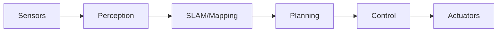

# Research: Chapter 3 - AI-Robot Brain (NVIDIA Isaac)

**Date**: 2025-12-27
**Feature**: 003-isaac-ai-brain

## Research Summary

This document captures research findings for implementing Chapter 3, resolving technical decisions and best practices for perception, navigation, SLAM, and reinforcement learning content.

---

## 1. ROS 2 Perception Best Practices

### Decision
Use sensor_msgs/Image with cv_bridge for camera processing; sensor_msgs/PointCloud2 for depth data; sensor_msgs/LaserScan for 2D LIDAR.

### Rationale
- Standard ROS 2 message types ensure compatibility with existing tools (RViz2, rosbag2)
- cv_bridge provides efficient conversion between ROS messages and OpenCV
- These patterns are used in Nav2 and SLAM Toolbox, ensuring consistency

### Alternatives Considered
- Custom message types: Rejected due to lack of tool support
- Direct OpenCV without ROS: Rejected as it breaks ROS 2 integration patterns

### Best Practices for Code Examples
```python
# Standard camera subscriber pattern
from sensor_msgs.msg import Image
from cv_bridge import CvBridge
import cv2

class CameraProcessor(Node):
    def __init__(self):
        super().__init__('camera_processor')
        self.bridge = CvBridge()
        self.subscription = self.create_subscription(
            Image, '/camera/image_raw', self.image_callback, 10)
    
    def image_callback(self, msg):
        cv_image = self.bridge.imgmsg_to_cv2(msg, 'bgr8')
        # Process image...
```

---

## 2. SLAM Toolbox Configuration Patterns

### Decision
Use SLAM Toolbox with async mode for online mapping; save maps in PGM/YAML format compatible with Nav2.

### Rationale
- SLAM Toolbox is the recommended SLAM solution for Nav2
- Async mode provides good balance of accuracy and performance
- PGM/YAML format is standard for Nav2 map_server

### Key Configuration Parameters
```yaml
# slam_toolbox_params.yaml
slam_toolbox:
  ros__parameters:
    solver_plugin: solver_plugins::CeresSolver
    ceres_linear_solver: SPARSE_NORMAL_CHOLESKY
    ceres_preconditioner: SCHUR_JACOBI
    mode: mapping  # or localization
    resolution: 0.05
    max_laser_range: 12.0
    minimum_time_interval: 0.5
    transform_timeout: 0.2
    tf_buffer_duration: 30.0
    stack_size_to_use: 40000000
```

### Alternatives Considered
- Cartographer: More complex setup, better for large-scale mapping
- GMapping: Legacy, less maintained for ROS 2

---

## 3. Nav2 Costmap and Planner Options

### Decision
Teach layered costmap approach with static, obstacle, and inflation layers. Cover NavFn (global) and DWB (local) as primary planners, with Smac and MPPI as advanced options.

### Rationale
- Layered costmaps are fundamental to understanding Nav2
- NavFn + DWB is the default and most well-documented configuration
- Smac planners provide better performance for complex environments
- MPPI is cutting-edge for dynamic obstacle avoidance

### Planner Comparison Table
| Planner | Type | Strengths | Use Case |
|---------|------|-----------|----------|
| NavFn | Global | Simple, fast | Basic navigation |
| Smac Hybrid-A* | Global | Ackermann-aware | Car-like robots |
| Smac Lattice | Global | Custom primitives | Humanoid bipeds |
| DWB | Local | Well-tested | General purpose |
| MPPI | Local | Dynamic obstacles | Complex environments |

### Costmap Layer Configuration
```yaml
local_costmap:
  ros__parameters:
    plugins: ["static_layer", "obstacle_layer", "inflation_layer"]
    static_layer:
      plugin: "nav2_costmap_2d::StaticLayer"
      map_subscribe_transient_local: True
    obstacle_layer:
      plugin: "nav2_costmap_2d::ObstacleLayer"
      observation_sources: scan
    inflation_layer:
      plugin: "nav2_costmap_2d::InflationLayer"
      inflation_radius: 0.55
      cost_scaling_factor: 2.0
```

---

## 4. Pre-trained RL Policy Sources

### Decision
Provide conceptual ONNX policy files for demonstration; reference NVIDIA Isaac Gym examples without requiring actual training.

### Rationale
- Training RL policies requires significant GPU resources (8+ hours)
- Pre-trained demos allow readers to observe behavior without training
- ONNX format is portable and works with multiple frameworks

### Policy Demo Approach
1. Provide small locomotion policy (humanoid walking) in ONNX format
2. Create simple Python loader using onnxruntime
3. Show policy evaluation in Gazebo (no training required)

### Code Pattern for Policy Loading
```python
import onnxruntime as ort
import numpy as np

class PolicyLoader:
    def __init__(self, model_path):
        self.session = ort.InferenceSession(model_path)
        self.input_name = self.session.get_inputs()[0].name
    
    def get_action(self, observation):
        obs = np.array(observation, dtype=np.float32).reshape(1, -1)
        action = self.session.run(None, {self.input_name: obs})[0]
        return action[0]
```

### Alternatives Considered
- TensorFlow/PyTorch models: Less portable, require specific frameworks
- Training in-chapter: Rejected due to GPU requirements and time constraints

---

## 5. Diagram Creation and Accessibility

### Decision
Use SVG format for all diagrams; Mermaid for flowcharts; include alt-text and color-blind safe palettes.

### Rationale
- SVG scales without quality loss
- Mermaid integrates with Markdown and is machine-readable
- Accessibility is required by NFR-001 through NFR-004

### Color Palette (Color-Blind Safe)
| Element | Color | Hex |
|---------|-------|-----|
| Primary | Blue | #0072B2 |
| Secondary | Orange | #E69F00 |
| Success | Teal | #009E73 |
| Warning | Yellow | #F0E442 |
| Error | Vermillion | #D55E00 |
| Neutral | Gray | #999999 |

### Diagram Types Needed
1. **Perception Pipeline**: Sensor → Processing → Understanding
2. **Sensor Comparison**: RGB vs Depth vs LIDAR matrix
3. **Navigation Architecture**: Costmap → Planner → Controller
4. **TF Tree**: Robot frames hierarchy
5. **RL Loop**: State → Action → Reward → Policy

### Mermaid Example


---

## 6. AI Agent Assisted Prompts

### Decision
Include 2-3 RAG-compatible prompts per lesson for learner assistance.

### Rationale
- Constitution Principle III requires Agent-Human Partnership
- Prompts help readers get unstuck and deepen understanding
- RAG-compatible format enables embedded chatbot queries

### Prompt Template
```markdown
## AI Agent Prompts

**Concept Check**: "Explain how [concept] works in the context of [lesson topic]"

**Debugging Help**: "I'm getting [error] when running [code]. What could be wrong?"

**Extension**: "How would I modify this code to [advanced use case]?"
```

---

## Research Validation

| Topic | Status | Confidence |
|-------|--------|------------|
| ROS 2 Perception | Complete | High |
| SLAM Toolbox | Complete | High |
| Nav2 Configuration | Complete | High |
| RL Policy Demos | Complete | Medium |
| Diagram Standards | Complete | High |
| AI Prompts | Complete | High |

**All NEEDS CLARIFICATION items resolved. Ready for Phase 1 design.**
