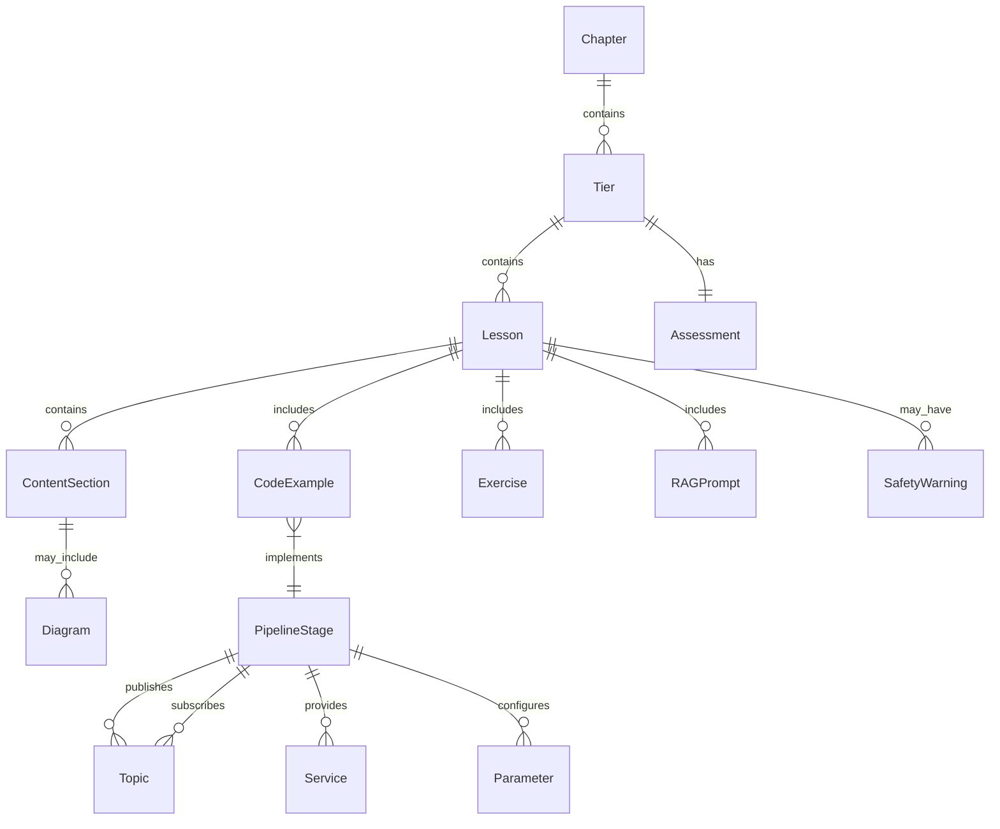
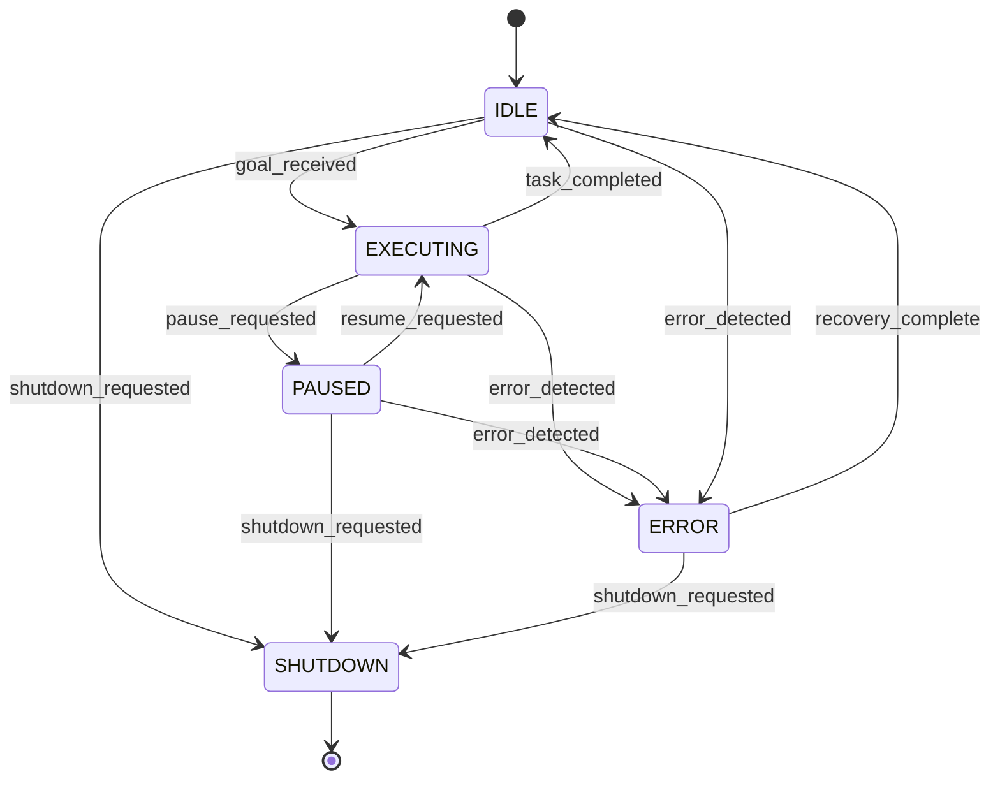
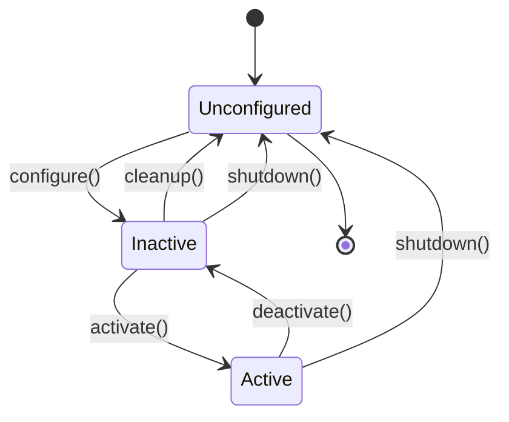

# Data Model: Chapter 4 - Workflow Orchestration

**Branch**: `004-workflow-orchestration` | **Date**: 2025-12-30
**Status**: Complete

---

## Overview

This document defines the data entities, relationships, and validation rules for the Workflow Orchestration chapter content and code examples.

---

## 1. Content Entities

### Chapter

The top-level container for all chapter content.

```yaml
Chapter:
  id: "04"
  title: "Workflow Orchestration"
  branch: "004-workflow-orchestration"
  status: "draft" | "review" | "approved" | "published"
  metadata:
    created_date: ISO8601
    last_modified: ISO8601
    author: string
    reviewers: string[]
  tiers:
    - Tier (beginner)
    - Tier (intermediate)
    - Tier (advanced)
  prerequisites:
    - "Chapter 1: Introduction to Physical AI"
    - "Chapter 2: The Robotic Nervous System"
    - "Chapter 3: The Digital Twin"
```

### Tier

A difficulty level grouping within the chapter.

```yaml
Tier:
  level: "beginner" | "intermediate" | "advanced"
  goal: string (1-2 sentences)
  objectives: string[] (3-5 items)
  lessons: Lesson[]
  assessment: Assessment
  estimated_duration_hours: number
```

### Lesson

An individual unit of instruction.

```yaml
Lesson:
  id: string (e.g., "B1", "I2", "A3")
  title: string
  tier: "beginner" | "intermediate" | "advanced"
  learning_objectives: string[]
  content_sections:
    - ContentSection
  code_examples:
    - CodeExample[] (minimum 1-2 per lesson)
  exercises:
    - Exercise[]
  rag_prompts:
    - RAGPrompt[]
  safety_warnings:
    - SafetyWarning[] (optional)
  estimated_duration_minutes: number
```

### ContentSection

A discrete section within a lesson.

```yaml
ContentSection:
  heading: string
  body: Markdown
  diagrams: Diagram[]
  callouts: Callout[]
```

### CodeExample

An executable code snippet.

```yaml
CodeExample:
  id: string
  title: string
  language: "python"
  code: string
  explanation: Markdown
  file_reference: string (path to full source file)
  execution_context: "standalone" | "ros2_node" | "launch_file"
  dependencies:
    - string (ROS 2 packages required)
  expected_output: string (optional)
```

### Exercise

A hands-on practice activity.

```yaml
Exercise:
  id: string
  title: string
  description: Markdown
  difficulty: "easy" | "medium" | "hard"
  starter_code: string (optional)
  solution_reference: string (path to solution)
  acceptance_criteria: string[]
  hints: string[]
  estimated_duration_minutes: number
```

### RAGPrompt

AI assistant prompts for learner support.

```yaml
RAGPrompt:
  category: "debugging" | "explanation" | "generation" | "extension"
  prompt_text: string
  expected_context: string (what the AI should know)
  example_response: string (optional)
```

### SafetyWarning

Safety callout for potentially dangerous operations.

```yaml
SafetyWarning:
  level: "caution" | "warning" | "danger"
  title: string
  message: Markdown
  applies_to: string[] (code sections or topics)
```

### Assessment

Tier-level evaluation criteria.

```yaml
Assessment:
  tier: "beginner" | "intermediate" | "advanced"
  type: "coding_exercise"
  test_file: string (path to pytest test file)
  passing_criteria:
    minimum_score_percent: number
    required_tests: string[]
  rubric:
    - criterion: string
      points: number
      description: string
```

### Diagram

Visual representation (Mermaid format).

```yaml
Diagram:
  id: string
  title: string
  type: "flowchart" | "sequence" | "state" | "class"
  source_file: string (path to .mmd file)
  alt_text: string (accessibility)
```

---

## 2. Code Entities (ROS 2)

### RobotState (Enum)

States for the workflow state machine.

```yaml
RobotState:
  values:
    - IDLE: "Waiting for task"
    - EXECUTING: "Task in progress"
    - PAUSED: "Task paused"
    - ERROR: "Error state"
    - SHUTDOWN: "Shutting down"
  transitions:
    IDLE -> EXECUTING: "goal_received"
    EXECUTING -> PAUSED: "pause_requested"
    PAUSED -> EXECUTING: "resume_requested"
    EXECUTING -> IDLE: "task_completed"
    ANY -> ERROR: "error_detected"
    ANY -> SHUTDOWN: "shutdown_requested"
```

### PipelineStage

A node in the processing pipeline.

```yaml
PipelineStage:
  name: string
  node_name: string (ROS 2 node name)
  package: string (ROS 2 package name)
  executable: string
  input_topics: Topic[]
  output_topics: Topic[]
  services_provided: Service[]
  services_required: Service[]
  parameters: Parameter[]
  dependencies: string[] (upstream stage names)
```

### Topic

ROS 2 topic definition.

```yaml
Topic:
  name: string
  message_type: string (e.g., "sensor_msgs/msg/LaserScan")
  qos_profile:
    reliability: "reliable" | "best_effort"
    durability: "volatile" | "transient_local"
    history_depth: number
  frequency_hz: number (expected publish rate)
```

### Service

ROS 2 service definition.

```yaml
Service:
  name: string
  service_type: string (e.g., "std_srvs/srv/SetBool")
  description: string
  timeout_sec: number
```

### Parameter

ROS 2 parameter definition.

```yaml
Parameter:
  name: string
  type: "bool" | "int" | "double" | "string" | "string[]"
  default_value: any
  description: string
  constraints: string (optional, e.g., "range: 0.0-10.0")
```

### WatchdogConfig

Configuration for health monitoring.

```yaml
WatchdogConfig:
  check_interval_sec: number (default: 1.0)
  timeout_sec: number (default: 5.0)
  max_recovery_attempts: number (default: 3)
  recovery_backoff_sec: number (default: 5.0)
  monitored_nodes: string[]
  alert_topic: string
```

---

## 3. Entity Relationships



---

## 4. Validation Rules

### Content Validation

| Rule ID | Entity | Rule | Error Message |
|---------|--------|------|---------------|
| CV-01 | Lesson | Must have 1-2 CodeExamples | "Lesson {id} requires at least one code example" |
| CV-02 | Lesson | Must have at least 1 Exercise | "Lesson {id} requires at least one exercise" |
| CV-03 | Tier | Must have exactly 3 Lessons | "Tier {level} must contain exactly 3 lessons" |
| CV-04 | CodeExample | Code must be syntactically valid Python | "Code in {id} contains syntax errors" |
| CV-05 | RAGPrompt | Each lesson must have 2+ prompts | "Lesson {id} needs more RAG prompts" |
| CV-06 | SafetyWarning | Motor control lessons must have warnings | "Motor control code requires safety warning" |

### Code Validation

| Rule ID | Entity | Rule | Error Message |
|---------|--------|------|---------------|
| CC-01 | PipelineStage | Dependencies must exist | "Stage {name} depends on unknown stage" |
| CC-02 | Topic | Message type must be valid ROS 2 type | "Unknown message type: {type}" |
| CC-03 | Parameter | Default must match declared type | "Parameter {name} type mismatch" |
| CC-04 | RobotState | Transitions must be to valid states | "Invalid transition target: {state}" |
| CC-05 | WatchdogConfig | Timeout must be > check_interval | "Timeout must exceed check interval" |

---

## 5. State Transitions

### RobotState Machine



### Pipeline Stage Lifecycle



---

## 6. Example Pipeline Configuration

### Mobile Robot Navigation Pipeline

```yaml
pipeline:
  name: "navigation_pipeline"
  stages:
    - name: "lidar_sensor"
      package: "workflow_examples"
      executable: "mock_lidar"
      output_topics:
        - name: "/robot/scan"
          message_type: "sensor_msgs/msg/LaserScan"
          frequency_hz: 10.0
      parameters:
        - name: "scan_rate_hz"
          type: "double"
          default_value: 10.0
        - name: "max_range"
          type: "double"
          default_value: 10.0

    - name: "path_planner"
      package: "workflow_examples"
      executable: "path_planner"
      dependencies: ["lidar_sensor"]
      input_topics:
        - name: "/robot/scan"
          message_type: "sensor_msgs/msg/LaserScan"
      output_topics:
        - name: "/robot/path"
          message_type: "nav_msgs/msg/Path"
          frequency_hz: 5.0
      parameters:
        - name: "lookahead_distance"
          type: "double"
          default_value: 1.5

    - name: "motor_controller"
      package: "workflow_examples"
      executable: "motor_controller"
      dependencies: ["path_planner"]
      input_topics:
        - name: "/robot/path"
          message_type: "nav_msgs/msg/Path"
      output_topics:
        - name: "/robot/cmd_vel"
          message_type: "geometry_msgs/msg/Twist"
          frequency_hz: 20.0
      parameters:
        - name: "max_linear_velocity"
          type: "double"
          default_value: 0.5
        - name: "max_angular_velocity"
          type: "double"
          default_value: 1.0

watchdog:
  check_interval_sec: 1.0
  timeout_sec: 5.0
  max_recovery_attempts: 3
  monitored_nodes:
    - "lidar_sensor"
    - "path_planner"
    - "motor_controller"
  alert_topic: "/supervisor/alerts"
```

---

*Data model completed: 2025-12-30*
